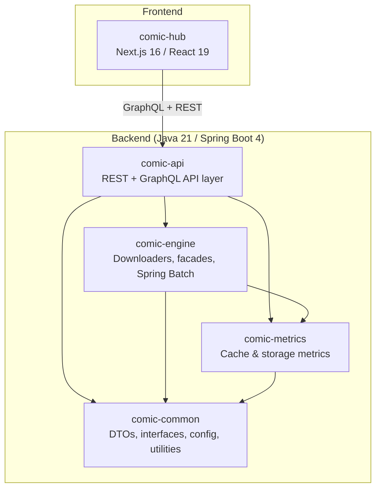
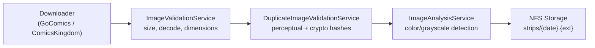

# CLAUDE.md

## Project Overview

ComicCacher is a web comic downloader and viewer application built as a multi-module Gradle project.

## Architecture

## Build Commands

**Backend:**
| Command | Purpose |
|---------|---------|
| `./gradlew clean build` | Full build |
| `./gradlew :comic-api:bootRun` | Run API server |
| `./gradlew :comic-api:test` | Unit tests |
| `./gradlew :comic-api:integrationTest` | Integration tests |
| `./gradlew clean checkstyleMain` | Checkstyle (project-level only) |
| `./gradlew rewriteRun` | Auto-fix imports/spacing/formatting |
| **`./gradlew clean testAll`** | **Final verification before any task** |

**Frontend (comic-hub):**
| Command | Purpose |
|---------|---------|
| `cd comic-hub && npm run dev` | Dev server (http://localhost:3000) |
| `cd comic-hub && npm run build` | Production build |
| `cd comic-hub && npm test` | Run tests |
| `cd comic-hub && npm run codegen` | GraphQL codegen |

## Git Workflow

- **Never commit or push directly to master.**
- **Never add `Co-Authored-By` lines to commit messages.**
- Branch naming: `feature/description` or `fix/description`
- Push and create PR via `gh pr create`

## Module Standards

Each module has its own coding standards. **Module-level standards override this file.**

| Module | Standards | Key Details |
|--------|-----------|-------------|
| **comic-api** | [@~/comic-api/CLAUDE.md](comic-api/CLAUDE.md) | GraphQL-first, Gson for persisted JSON (Jackson allowed at Spring boundaries), NFS filesystem as DB, JWT auth (USER/OPERATOR/ADMIN), Lombok DTOs |
| **comic-engine** | [@~/comic-engine/CLAUDE.md](comic-engine/CLAUDE.md) | Downloaders (GoComics Selenium, ComicsKingdom Jsoup), facades, Spring Batch jobs, image pipeline |
| **comic-common** | [@~/comic-common/CLAUDE.md](comic-common/CLAUDE.md) | Shared DTOs, service interfaces, utilities — no Spring beans |
| **comic-metrics** | [@~/comic-metrics/CLAUDE.md](comic-metrics/CLAUDE.md) | Cache and storage metrics, event-driven persistence |
| **comic-hub** | [@~/comic-hub/CLAUDE.md](comic-hub/CLAUDE.md) | Next.js 16 / React 19, server components, httpOnly cookie auth via `/api/graphql`, z-index tokens |

## Time Handling Rules

| Context | Rule |
|---------|------|
| **Storage** | UTC always. Use `OffsetDateTime` or `Instant`, never bare `LocalDateTime` |
| **Date-only values** | `LocalDate` is fine (comic dates, filter ranges) |
| **Spring Batch boundary** | Convert `LocalDateTime` at resolver boundary using `batch.timezone` property |
| **GraphQL wire format** | `DateTime` scalar = ISO-8601 with offset (e.g., `2026-03-18T10:00:00-04:00`) |
| **Frontend** | `new Date(isoString)` for parsing, `toLocaleString()` for display. Never assume a timezone |
| **Gson** | `OffsetDateTimeAdapter` for new code. `LocalDateTimeAdapter` for backward compat only |

## Data Flow: Comic Download Pipeline

See [@~/docs/design/download-pipeline.md](docs/design/download-pipeline.md) and [@~/docs/design/image-validation.md](docs/design/image-validation.md).

## Documentation Index

Full docs live in [@~/docs/README.md](docs/README.md):

| Area | Key Documents |
|------|--------------|
| **API** | [@~/docs/api/overview.md](docs/api/overview.md) (auth, pagination, errors), [@~/docs/api/comics.md](docs/api/comics.md), [@~/docs/api/batch-jobs.md](docs/api/batch-jobs.md) |
| **Design** | [@~/docs/design/architecture.md](docs/design/architecture.md), [@~/docs/design/batch-jobs.md](docs/design/batch-jobs.md), [@~/docs/design/downloader-strategies.md](docs/design/downloader-strategies.md) |
| **Storage** | [@~/docs/storage/overview.md](docs/storage/overview.md) (NFS layout, atomic writes), [@~/docs/storage/comic-data.md](docs/storage/comic-data.md) |

## Debug Utilities

- **`utils/fetch-prod-logs.sh [api|ui] [lines]`** — Fetch Docker logs from production `comics-api` or `comics-ui` container (default 500 lines)
- **`utils/tunnel-to-prod-api.sh`** — SSH tunnel: `localhost:8888` to production API
- **`utils/dev-build-and-run.sh`** — Build and deploy a dev instance via Docker context
- **`utils/verify-json-files.sh`** — Validate JSON storage files in the comics cache

## Known Modernization Backlog

Tracked here so doc-review sweeps don't keep rediscovering them. Items may be picked up in any order:

- **Spring Boot 4 lightweight configs** — apply `@Configuration(proxyBeanMethods = false)` to all `@Configuration` classes that don't call other `@Bean` methods (currently 17 files).
- **`@ConfigurationProperties` constructor binding** — modernize property classes to constructor binding (Lombok `@AllArgsConstructor` + `@ConstructorBinding` where needed).
- **RFC 7807 Problem Details** — migrate error responses from custom `ApiResponse<T>` wrapper to Spring Boot 4 `ProblemDetail`. Keep `ApiResponse<T>` for success-path payloads.
- **Logout backend revocation** — `/api/logout` currently only clears client cookies. Add a backend endpoint that invalidates the refresh token, and call it from `comic-hub/src/app/api/logout/route.ts` before clearing cookies.
