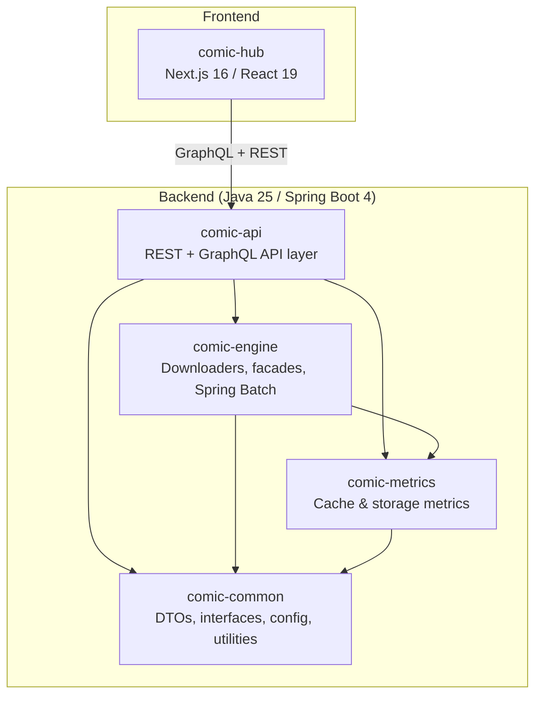
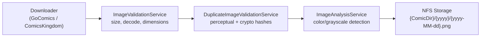

# CLAUDE.md

## Project Overview

ComicCacher is a web comic downloader and viewer application built as a multi-module Gradle project.

## Architecture

```mermaid
graph TD
    subgraph Backend ["Backend (Java 25 / Spring Boot 4)"]
        COMMON["comic-common<br/>DTOs, interfaces, config, utilities"]
        METRICS["comic-metrics<br/>Cache & storage metrics"]
        ENGINE["comic-engine<br/>Downloaders, facades, Spring Batch"]
        API["comic-api<br/>REST + GraphQL API layer"]
    end

    subgraph Frontend
        HUB["comic-hub<br/>Next.js 16 / React 19"]
    end

    API --> ENGINE
    API --> METRICS
    API --> COMMON
    ENGINE --> METRICS
    ENGINE --> COMMON
    METRICS --> COMMON
    HUB -->|GraphQL + REST| API
```

## Build Commands

**Backend:**
| Command | Purpose |
|---------|---------|
| `./gradlew clean build` | Full build |
| `./gradlew :comic-api:bootRun` | Run API server |
| `./gradlew :comic-api:test` | Unit tests |
| `./gradlew :comic-api:integrationTest` | Integration tests |
| `./gradlew clean checkstyleMain checkstyleTest checkstyleIntegration` | Checkstyle (any warning fails the build) |
| `./gradlew rewriteRun` | Auto-fix imports/spacing/formatting |
| **`./gradlew clean testAll`** | **Final verification before any task** |

**Frontend (comic-hub):**
| Command | Purpose |
|---------|---------|
| `utils/dev-ui.sh` | Dev server (http://localhost:3000) against the dev API |
| `cd comic-hub && npm run build` | Production build |
| `cd comic-hub && npm test` | Run tests |
| `cd comic-hub && npm run codegen` | GraphQL codegen |

## Git Workflow

- **Never commit or push directly to master.**
- **Never add `Co-Authored-By` lines to commit messages.**
- Branch naming: `feature/description` or `fix/description`
- Push and create PR via `gh pr create`

## Module Standards

Each module has its own coding standards. **Module-level standards override this file.**

| Module | Standards | Key Details |
|--------|-----------|-------------|
| **comic-api** | [@~/comic-api/CLAUDE.md](comic-api/CLAUDE.md) | GraphQL-first, Gson for persisted JSON (Jackson allowed at Spring boundaries), NFS filesystem as DB, JWT auth (USER/OPERATOR/ADMIN; nothing assigns OPERATOR, so admins are the operators), Lombok DTOs |
| **comic-engine** | [@~/comic-engine/CLAUDE.md](comic-engine/CLAUDE.md) | Downloaders (GoComics / ComicsKingdom / Freefall / xkcd via Jsoup, per-source throttling + 429 backoff), facades, Spring Batch jobs, image pipeline |
| **comic-common** | [@~/comic-common/CLAUDE.md](comic-common/CLAUDE.md) | Shared DTOs, service interfaces, utilities — no Spring beans |
| **comic-metrics** | [@~/comic-metrics/CLAUDE.md](comic-metrics/CLAUDE.md) | Cache and storage metrics, event-driven persistence |
| **comic-hub** | [@~/comic-hub/CLAUDE.md](comic-hub/CLAUDE.md) | Next.js 16 / React 19, server components, httpOnly cookie auth via `/api/graphql`, z-index tokens |

## Time Handling Rules

| Context | Rule |
|---------|------|
| **Application zone** | `batch.timezone` (America/Toronto) is the only zone: cron schedules, what "today" is, batch times and log timestamps. The JVM runs in UTC in the containers, and nothing may depend on its zone |
| **"Today"** | `LocalDate.now(clock)` with the injected `Clock` bean (`ClockConfiguration`, in `batch.timezone`). Tests pass `Clock.fixed(...)` |
| **Storage** | UTC always. Use `OffsetDateTime` or `Instant`, never bare `LocalDateTime`. New timestamps: `OffsetDateTime.now(ZoneOffset.UTC)` |
| **Date-only values** | `LocalDate` is fine (comic dates, filter ranges) |
| **Spring Batch boundary** | Spring Batch stamps job/step times with `LocalDateTime.now()` in the JVM's zone. Convert them with `DateTimeUtils.toOffset(ldt, zone)`, which reads them in the JVM zone and returns `batch.timezone` |
| **Guard** | `checkTimeZoneIndependence` (part of `check` and `testAll`) fails on zone-less `now()`, `ZoneId.systemDefault()` and `Clock.systemDefaultZone()` in main code. Tests run with `user.timezone=UTC` |
| **GraphQL wire format** | `DateTime` scalar = ISO-8601 with offset (e.g., `2026-03-18T10:00:00-04:00`) |
| **Frontend** | `new Date(isoString)` for parsing, `toLocaleString()` for display. Never assume a timezone |
| **Gson** | `OffsetDateTimeAdapter` for new code. `LocalDateTimeAdapter` for backward compat only |

## Logging Conventions

| Rule | Detail |
|------|--------|
| **Levels** | ERROR = unexpected failure someone should look at. WARN = expected failure or degraded result (404, 429, bad input, rejected token). INFO = state changes and one summary line per request, job or download run. DEBUG = per-item detail and read paths |
| **Exceptions** | Unexpected failures pass the exception as the last argument (`log.error("... {}", id, e)`) for a compact stack trace. Expected ones log one line: `e.toString()` or status + message, no trace |
| **Stack traces** | Compact by design: `logging.exception-conversion-word` in `application.properties` (12 frames per cause, framework frames folded) applies to the console and the per-execution batch logs |
| **Context** | MDC keys in `LogContext` (`requestId`, `user`, `gqlOp`, `comic`, `date`, `strip`) plus `batchJobExecutionId` print as `[req=… user=… comic=…]` via `%ctx`. Set them with `MDC.putCloseable` in try-with-resources; pools use `MdcTaskDecorator` |
| **Requests** | `RequestLoggingFilter` logs one line per `/graphql` and `/api/**` request and returns `X-Request-Id`, so a user report can be matched to its log lines |
| **Timing** | The request line ends with where the time went: `(gql=790ms slowest=Comic.strip:640ms storage=3/610ms)`. `Slow request:` / `Slow storage read` WARN lines fire at `comics.timing.slow-*-ms`, and one `Slow GraphQL fields (<op>): <n> over <ms>ms, slowest …` WARN per request counts the fields over `slow-fetcher-ms` (per-field times are at DEBUG). comic-hub logs `graphql <op> -> <status> in <n>ms req=<id>` for every server-side API call (WARN from `SLOW_FETCH_MS`), sending the same `X-Request-Id` so both logs match |
| **Audit** | Admin changes log `AUDIT …` at INFO; the acting user comes from the log context |
| **Never log** | Passwords, tokens, Authorization headers, or full email addresses (use `LogContext.maskEmail`) |
| **One ERROR per failure** | Log the cause where it happens; callers that only pass the result on log at DEBUG |

## Data Flow: Comic Download Pipeline

```mermaid
graph LR
    DL["Downloader<br/>(GoComics / ComicsKingdom)"] --> VAL["ImageValidationService<br/>size, decode, dimensions"]
    VAL --> DEDUP["DuplicateImageValidationService<br/>perceptual + crypto hashes"]
    DEDUP --> ANALYZE["ImageAnalysisService<br/>color/grayscale detection"]
    ANALYZE --> STORE["NFS Storage<br/>{ComicDir}/{yyyy}/{yyyy-MM-dd}.png"]
```

See [@~/docs/design/download-pipeline.md](docs/design/download-pipeline.md) and [@~/docs/design/image-validation.md](docs/design/image-validation.md).

## Documentation Index

Full docs live in [@~/docs/README.md](docs/README.md):

| Area | Key Documents |
|------|--------------|
| **API** | [@~/docs/api/overview.md](docs/api/overview.md) (auth, pagination, errors), [@~/docs/api/comics.md](docs/api/comics.md), [@~/docs/api/batch-jobs.md](docs/api/batch-jobs.md) |
| **Design** | [@~/docs/design/architecture.md](docs/design/architecture.md), [@~/docs/design/batch-jobs.md](docs/design/batch-jobs.md), [@~/docs/design/downloader-strategies.md](docs/design/downloader-strategies.md) |
| **Storage** | [@~/docs/storage/overview.md](docs/storage/overview.md) (NFS layout, atomic writes), [@~/docs/storage/comic-data.md](docs/storage/comic-data.md) |

## Utility Scripts

**Always use the `utils/` scripts** to run, deploy, or inspect ComicCacher. Don't hand-roll the equivalent `npm`, `docker`, or `ssh` commands: the scripts carry the hosts, ports, Node setup, and safety checks. If a task needs something no script covers, add or extend a script in `utils/` rather than running one-off commands.

- **`utils/dev-ui.sh [--api <url>]`** — Run the comic-hub dev server locally against the dev API (`comics-api-dev`, `http://portainer.stapledon.ca:8087/graphql`). Loads nvm, installs dependencies if missing, and checks the API first. No `comic-hub/.env.local` needed
- **`utils/deploy.sh <dev|prod> [--api <ver>] [--ui <ver>] [--skip-build] [--dry-run]`** — Build and push with `build.sh`, stage `utils/remote/run.sh` and the environment's compose file on the Docker host (`/root/comics-deploy` for prod, `/root/comics-deploy-dev` for dev), and run it over ssh. The environment is a required first argument with no default. prod needs a clean checkout of exactly origin/master (also for `--skip-build`), and each image must be a clean build of a commit on origin/master (read from its labels in the registry); it is then deployed pinned to the checked digest. `--allow-unverified-image` overrides that check for an image built before the labels, and the audit log records `provenance=override`. dev deploys from any branch and has no UI container. `--dry-run` skips the build and shows the plan without deploying
- **`utils/build.sh <dev|prod> [--api <ver>] [--ui <ver>]`** — Build and push the images only (Skopeo to the registry's port 5000), then check the registry has them. Labels each image with its commit, branch and dirty state. prod: a clean checkout of exactly origin/master, and never reuses a version that holds a build of another master commit or an unlabelled image. Give dev builds prerelease tags (`2.6.0-rc1`)
- **`utils/remote/run.sh <dev|prod> [--api <ver>[@sha256:…]] [--ui <ver>] [--dry-run]`** — Runs on the Docker host, next to the compose file it must match: compose pull/up for the changed services and a health poll. prod adds the confirm prompt, the audit log at `~/.comiccacher-prod-deploy.log`, and automatic rollback to the previous digests and last good compose file. dev leaves a failed container running, and creates `dev-token.env` on first run, which turns on the dev-only `devToken` mutation and defaults it to the USER-role test account `uireview0927` (see "Dev Tokens" in [@~/docs/api/overview.md](docs/api/overview.md)). Both create `comics-promotion.env` beside the deploy directories on first run, the token dev and prod share for `PromoteFromDevJob` (see [@~/docs/api/promotion.md](docs/api/promotion.md))
- **`utils/logs.sh <dev|prod> [api|ui] [lines]`** — Print a container's recent Docker logs (default: api, 500 lines). Read-only; for a full report use the `comiccacher-logs` skill
- **`utils/tunnel.sh prod`** — SSH tunnel: `localhost:8888` to the production API (dev's API is already exposed on port 8087)
- **`utils/readme-screenshots.sh`** — Regenerate the README banner and screenshots in `docs/images/readme/`. Runs Comics Hub against `utils/readme-demo/demo-api.mjs` (the real GraphQL schema serving invented comics with original placeholder art), so no real strips appear. Needs Chrome and a free port 3000
- **`utils/verify-json-files.sh <cache_root>`** — Check that the cache root has the JSON files the API writes, flag obsolete ones, and check that every strip has its metadata sidecar
- **`utils/test/run-tests.sh [--update] [name]`** — Sandboxed tests for the deploy scripts: stub docker, ssh, registry and git record every command against the baselines in `utils/test/expected.txt`. Nothing leaves the machine. Run after any change to a deploy script, and review every baseline diff that `--update` writes

