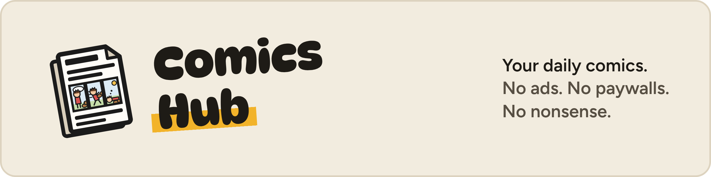
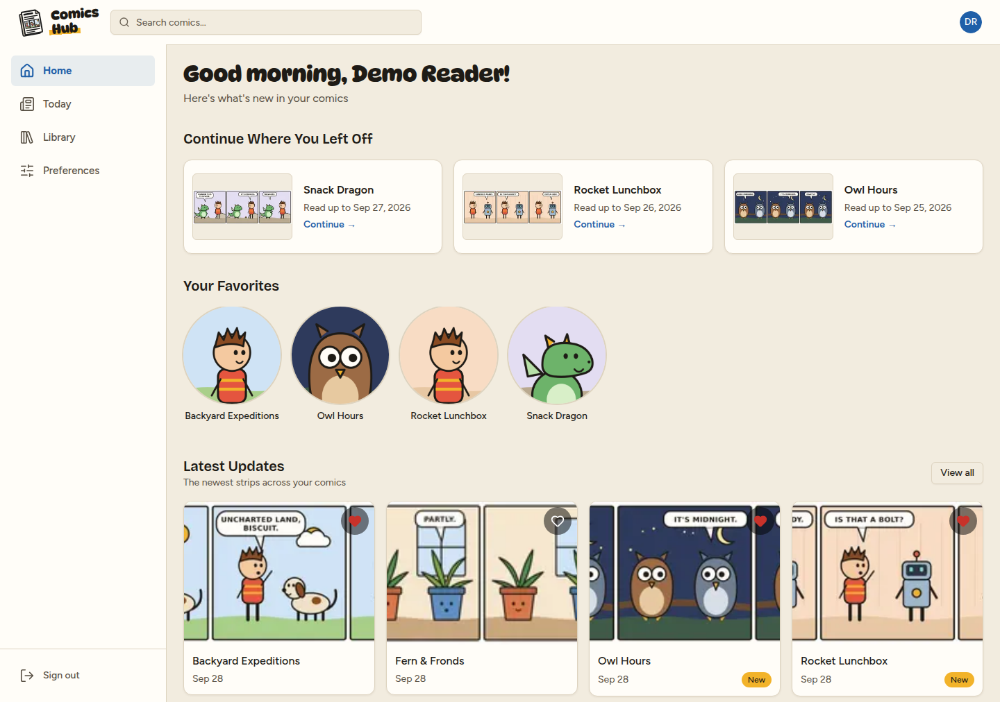
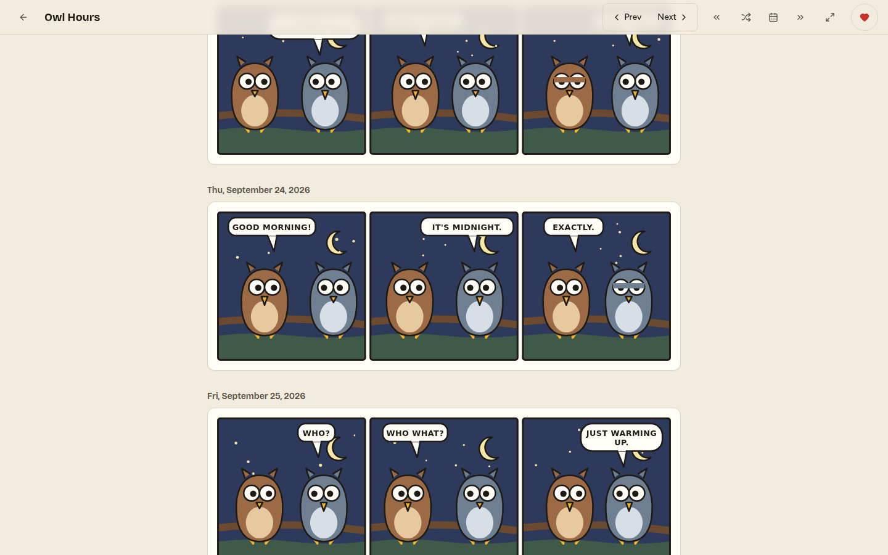
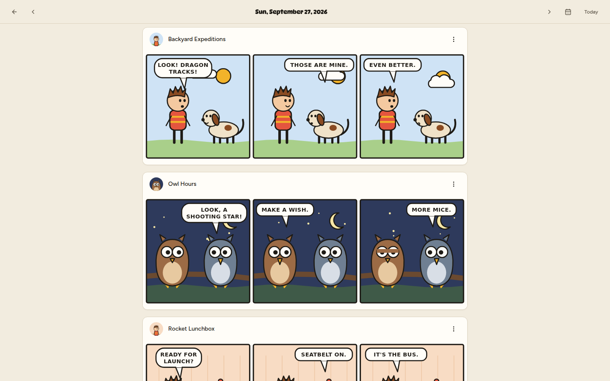
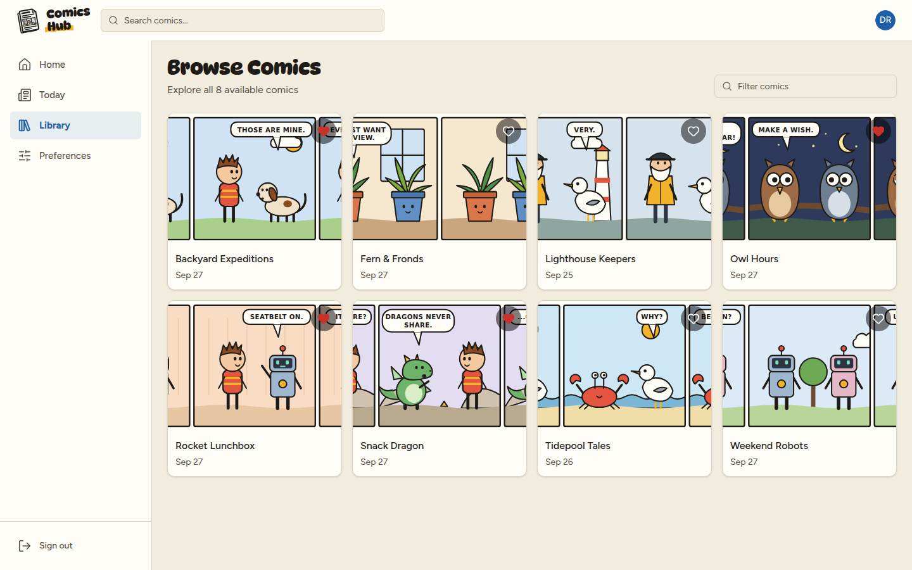
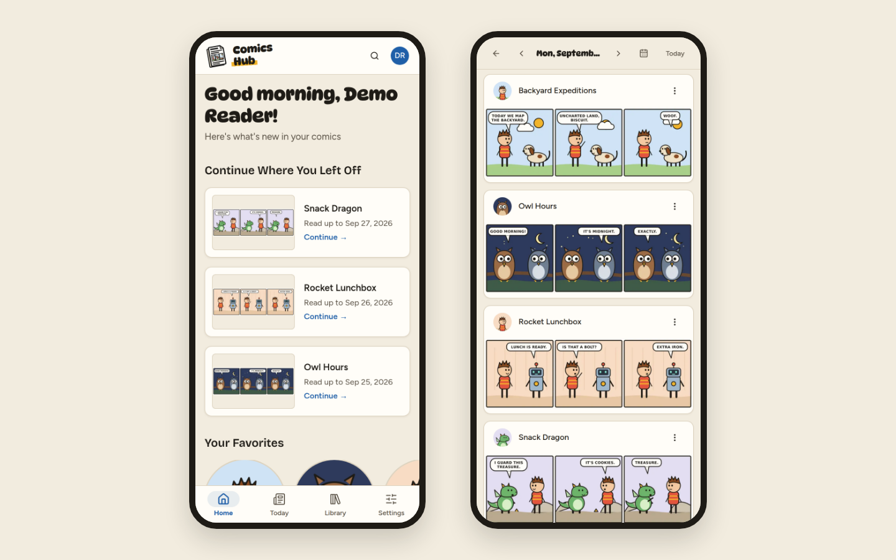
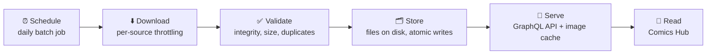

<p align="center">
  
</p>

<p align="center">
  <a href="https://github.com/KKDad/ComicCacher/actions/workflows/gradle.yml"></a>
  <a href="https://github.com/KKDad/ComicCacher/actions/workflows/comic-hub.yml"></a>
  
  
  
  <a href="LICENSE"></a>
</p>

**ComicCacher** is a self-hosted comic strip reader. Every morning it collects your favorite daily strips, keeps them on your own server, and serves them through **Comics Hub**, a calm reading app for desktop and phone. There are no ads, no pop-ups and no tracking, just the comics.

<p align="center">
  
</p>

## Why?

Reading a four-panel strip online usually means autoplay video, cookie banners, newsletter pop-ups and a page that keeps shifting under your thumb. ComicCacher fetches the strips once, stores them locally, and gives you a quiet place to read them.

## Reading with Comics Hub

- **Today.** All of your favorites for the day on one page, with the date picker a tap away.
- **Pick up where you left off.** Your place is saved in each comic, and the address follows along, so a refresh or a shared link opens the same strip.
- **Made for reading.** Scroll with the keyboard (PageDown, Space, J/K to step one strip) or open a strip fullscreen with **F**.
- **Your library.** Browse, filter and ❤️ comics; favorites feed Today and the home page.
- **Easy on the eyes.** A warm Newsprint theme and a dark Ink theme that dims bright strips, following your system setting by default.
- **At home on a phone.** A thumb-friendly tab bar and full-width strips.

<table>
  <tr>
    <td width="50%"></td>
    <td width="50%"></td>
  </tr>
  <tr>
    <td width="50%"></td>
    <td width="50%"></td>
  </tr>
</table>

<sub>The screenshots use invented demo comics with placeholder art. See [Regenerating the screenshots](#regenerating-the-screenshots).</sub>

## Behind the scenes

- **Hands-off downloads.** A scheduled job collects new strips each morning. If the server was off, it catches up on start-up.
- **Self-healing.** Backfill jobs fill gaps, refresh avatars and repair metadata. Operators can watch every run from the admin pages.
- **No duplicates.** Images are checked for integrity and compared by perceptual and cryptographic hashes, so a re-posted strip is skipped.
- **Fast.** Strips are cached and prefetched, so the next one is usually on screen before you ask for it.
- **Simple to host.** No database: two containers and a folder of files.
- **Accounts and roles.** Readers, operators and admins, each seeing only what they need.

## Supported sources

| Source | Comics |
|--------|--------|
| [GoComics](https://www.gocomics.com) | 300+ |
| [Comics Kingdom](https://comicskingdom.com) | 100+ |
| [Freefall](http://freefall.purrsia.com) | 1 |

Adding a source means writing a downloader strategy; see [downloader strategies](docs/design/downloader-strategies.md).

## How it works



The backend is a set of Spring Boot modules. The download engine and batch jobs live in `comic-engine`, and the GraphQL and REST API lives in `comic-api`. The Next.js app in `comic-hub` talks to the API through its own server, so login tokens stay in httpOnly cookies. The [architecture guide](docs/design/architecture.md) goes deeper.

## Run your own

### With containers

The backend and frontend each build into an image:

```bash
./gradlew :comic-api:bootJar -PbuildVersion=<tag> \
  && docker build --build-arg VERSION=<tag> -t comic-api:<tag> comic-api   # API, port 8888
docker build -t comic-ui:<tag> comic-hub                                     # web app, port 8080
```

Mount a folder (local or NFS) at `/comics` in the API container; that folder is the whole data store. [`utils/prod/docker-compose.yml`](utils/prod/docker-compose.yml) is a working example, including the batch schedules.

### From source

You'll need **Java 25** and **Node.js 24 LTS**.

```bash
./gradlew :comic-api:bootRun      # API on localhost:8888 (GraphQL at /graphql)

cd comic-hub
cp .env.example .env.local        # point NEXT_PUBLIC_GRAPHQL_ENDPOINT at your API
npm install && npm run dev        # Comics Hub on localhost:3000
```

## Tech stack

| Layer | Tech |
|-------|------|
| **Backend** | Java 25, Spring Boot 4, Spring Batch, Spring GraphQL, Caffeine |
| **Downloads** | Jsoup, TwelveMonkeys ImageIO, perceptual hashing |
| **Frontend** | Next.js 16, React 19, TypeScript, Tailwind CSS 4, TanStack Query |
| **Storage** | Plain files (JSON and images), NFS-safe atomic writes |

## Project layout

```
ComicCacher/
├── comic-common/    Shared DTOs, config and service interfaces
├── comic-metrics/   Cache and storage metrics
├── comic-engine/    Downloaders, image pipeline, batch jobs
├── comic-api/       GraphQL + REST API
├── comic-hub/       Comics Hub web app
├── docs/            API, design and storage docs
└── utils/           Run, deploy and inspect scripts
```

## Development

- **Docs:** the [docs index](docs/README.md) covers the API, the design and the storage layout.
- **Workflow:** [CLAUDE.md](CLAUDE.md) lists the build commands, coding standards and the `utils/` scripts. Run `./gradlew clean testAll` before sending a PR.
- **Front end:** `utils/dev-ui.sh` runs Comics Hub against the dev API, with no local config needed.

### Regenerating the screenshots

```bash
./utils/readme-screenshots.sh
```

This starts a small demo API (`utils/readme-demo/`), which serves invented comics with original placeholder art from the real GraphQL schema. It points Comics Hub at that API and captures light-mode screenshots with headless Chrome into `docs/images/readme/`. No real strips are involved. It needs Google Chrome and a free port 3000.

## The story

This project started in **2013** as a quick C#/.NET 3.0 script to grab a few comics. Since then it has been rewritten and rearchitected more than once: first in Java and Spring, then as Spring Boot 4 with a GraphQL API, and most recently with a Next.js 16 front end. After 500+ commits it has been serving up daily laughs for over a decade.

There's no public deployment. This is a personal project, built for fun and for learning, but the code is here if you want to run your own. PRs and ideas are welcome: see [CONTRIBUTING.md](CONTRIBUTING.md) and the [Code of Conduct](CODE_OF_CONDUCT.md).

## Notice

This software is intended for **personal, private use only**. It is not designed to publicly broadcast, redistribute, or archive comic strips. Downloaded comics must not be shared publicly without explicit permission from the copyright holder.

**Please support the creators.** The artists and writers behind these strips deserve your support. Visit their official sites, buy their books, or donate directly. They make the comics you enjoy every day.

If you are a comic publisher or copyright holder and would like your content excluded from ComicCacher, please [open an issue](../../issues/new) and we will promptly remove support for your strips.
