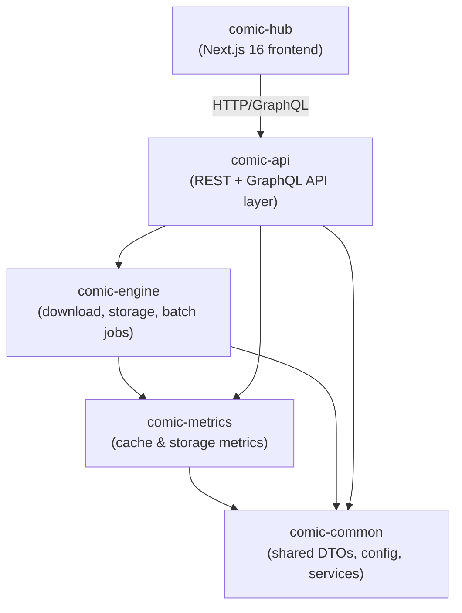
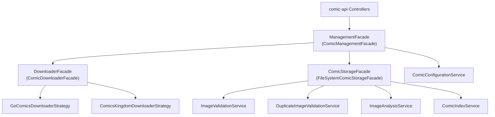

# Architecture

## Module Dependency Graph

## Module Responsibilities

### comic-common

Shared foundation with zero external module dependencies. All other modules depend on it.

| Area | Key Classes |
|------|-------------|
| DTOs | `ComicItem`, `ComicConfig`, `ComicDownloadRequest`, `ComicDownloadResult`, `ComicRetrievalRecord`, `ImageDto`, `ImageValidationResult`, `DuplicateValidationResult`, `ImageMetadata`, `ImageHashRecord`, `SaveResult`, `ComicIdentifier` |
| Enums | `ImageFormat` (PNG, JPEG, GIF, BMP, WEBP, TIFF, UNKNOWN), `HashAlgorithm` (MD5, SHA256, AVERAGE_HASH, DIFFERENCE_HASH), `ComicRetrievalStatus`, `Direction` |
| Service interfaces | `ValidationService`, `DuplicateValidationService`, `AnalysisService`, `ComicStorageFacade`, `ComicConfigurationService`, `RetrievalStatusService`, `ErrorTrackingService`, `ImageHasher` |
| Infrastructure | `InspectorService`, `CacheProperties`, `ImageUtils`, `NfsFileOperations` |

### comic-metrics

Metrics collection and archival. Depends on comic-common only.

| Area | Key Classes |
|------|-------------|
| Collectors | `CacheMetricsCollector`, `StorageMetricsCollector` |
| Writers | `StatsWriter` (JSON/Console output) |
| Archive | `MetricsArchiveService` (used by `MetricsArchiveJobConfig` in comic-engine) |

### comic-engine

Download engine, filesystem storage, image validation, and Spring Batch job infrastructure. Depends on comic-common and comic-metrics.

| Area | Key Classes |
|------|-------------|
| Download strategies | `ComicDownloaderStrategy` (interface), `AbstractComicDownloaderStrategy`, `GoComicsDownloaderStrategy`, `ComicsKingdomDownloaderStrategy` |
| Legacy downloaders | `IDailyComic` (interface), `DailyComic`, `GoComics` (Selenium-based), `ComicsKingdom` (Jsoup-based) |
| Facades | `DownloaderFacade` / `ComicDownloaderFacade`, `ManagementFacade` / `ComicManagementFacade`, `ComicStorageFacade` / `FileSystemComicStorageFacade` |
| Storage | `FileSystemComicStorageFacade`, `ComicIndexService`, `DuplicateImageHashRepository`, `ImageMetadataRepository`, `JsonRetrievalStatusRepository`, `JsonErrorTrackingRepository` |
| Validation | `ImageValidationService`, `DuplicateImageValidationService`, `DuplicateHashCacheService`, `ImageHasherFactory` |
| Hash algorithms | `MD5ImageHasher`, `SHA256ImageHasher`, `AverageImageHasher`, `DifferenceImageHasher` |
| Analysis | `ImageAnalysisService` (color/grayscale detection via pixel sampling) |
| Batch infrastructure | `AbstractJobScheduler`, `DailyJobScheduler`, `PeriodicJobScheduler`, `SchedulerTriggers`, `StartupJobRunner`, `SchedulerStateService`, `SchedulerStateWiring`, `JsonBatchExecutionTracker`, `BatchJobBaseConfig` |
| Batch jobs | `ComicRetrievalJobConfig`, `ComicBackfillJobConfig`, `AvatarBackfillJobConfig`, `ImageMetadataBackfillJobConfig`, `MetricsArchiveJobConfig`, `RetrievalRecordPurgeJobConfig` |
| Batch support | `ComicBackfillService`, `BackfillConfigurationService`, `BatchJobMonitoringService`, `ComicJobSummary`, `LoggingJobExecutionListener` |

### comic-api

REST + GraphQL API layer. Depends on all three backend modules.

| Area | Key Classes |
|------|-------------|
| Controllers | `ComicController`, `UpdateController`, `BatchJobController` |
| Services | `UpdateService`, `RetrievalStatusServiceImpl`, `AuthService`, `UserService`, `PreferenceService` |
| Repositories | `ComicRepository`, `UserRepository`, `PreferenceRepository` |
| Security | JWT-based authentication with `AuthService` |

### comic-hub

Next.js 16 App Router frontend with httpOnly cookie auth, server-side GraphQL proxy, and codegen-generated hooks.

## Facade Pattern

ComicCacher uses a layered facade pattern where each facade owns a well-defined domain and higher-level facades compose lower-level ones.

### ManagementFacade (ComicManagementFacade)

The top-level orchestrator. All API controllers talk to this facade. It coordinates between:

- **DownloaderFacade** for downloading comics and avatars
- **ComicStorageFacade** for reading/writing image files
- **ComicConfigurationService** for comic metadata (JSON config files)
- **RetrievalStatusService** for download tracking records

### DownloaderFacade (ComicDownloaderFacade)

Coordinates comic downloads using a strategy registry (`Map<String, ComicDownloaderStrategy>`). Strategies are registered at startup by source name (e.g., `"gocomics"`, `"comicskingdom"`). The facade:

1. Resolves the correct strategy from the request's `source` field
2. Delegates to `strategy.downloadComic(request)`
3. Records success/failure via `RetrievalStatusService` and `ErrorTrackingService`
4. Supports batch downloads via `downloadComicsForDate()` with day-of-week filtering and inactive comic filtering

### ComicStorageFacade (FileSystemComicStorageFacade)

Abstracts all filesystem operations. On save, it runs a full pipeline: image validation, duplicate detection, file write, index update, and metadata analysis. On read, it provides navigation (next/previous/newest/oldest dates) through `ComicIndexService`.

## Caffeine Caching

ComicCacher uses an in-memory Caffeine cache to reduce NFS reads for frequently accessed metadata. The cache is enabled by default (`comics.cache.caffeine.enabled=true`) and configured in `CaffeineCacheConfiguration`.

### comicMetadata Cache

The single active cache stores `ComicItem` configuration data:

| Setting | Property | Default |
|---------|----------|---------|
| Max entries | `comics.cache.caffeine.metadata.max-size` | `60` |
| TTL | `comics.cache.caffeine.metadata.ttl-minutes` | `60` |

**Cached operations** (in `ComicManagementFacade`):
- `getAllComics()` -- cached under key `allComics`
- Evicted on: `createComic()`, `updateComic()`, `deleteComic()`, `downloadMissingAvatars()`

### Predictive Lookahead

`PredictiveCacheService` asynchronously prefetches adjacent comic strips when a user navigates, warming the cache with N strips in the navigation direction.

| Setting | Property | Default |
|---------|----------|---------|
| Enabled | `comics.cache.caffeine.lookahead.enabled` | `false` |
| Prefetch count | `comics.cache.caffeine.lookahead.count` | `3` |

**Note:** `application.properties` also defines `navigation`, `boundary`, and `navigation-dates` cache properties, but these are not currently bound to `CaffeineCacheProperties` and have no effect.

## Build System

Gradle multi-module project with centralized dependency management in the root `build.gradle`. All modules share:

- Java 21 toolchain
- JaCoCo coverage enforcement (per-module thresholds)
- Checkstyle via `config/checkstyle/checkstyle.xml`
- OpenRewrite recipes for style enforcement
- Lombok annotation processing

The `testAll` task runs all tests across all subprojects and enforces coverage thresholds.
