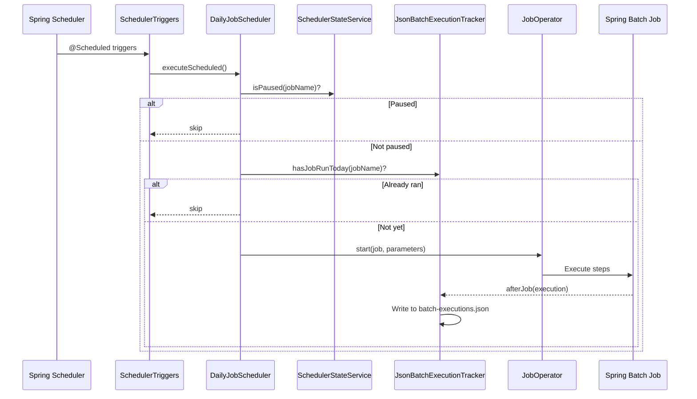
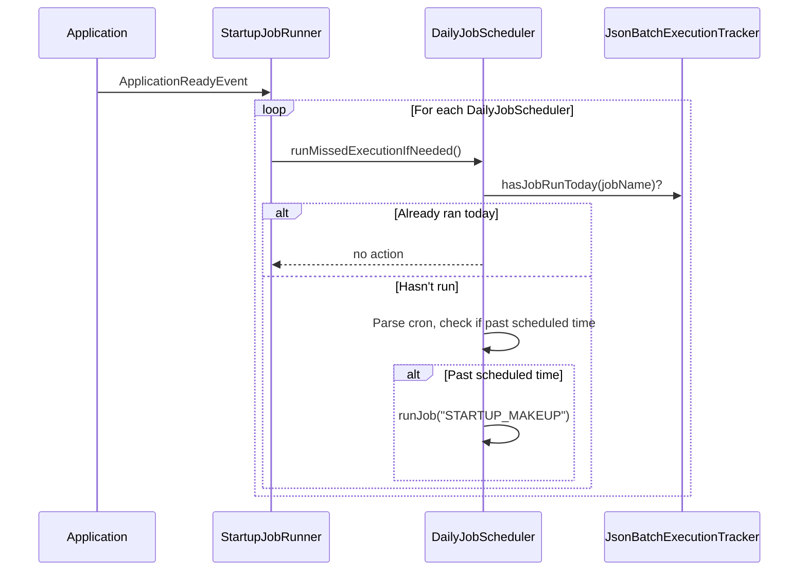

# Batch Jobs

## Shared Infrastructure

All batch jobs are built on Spring Batch and share a common scheduler framework in `comic-engine`.

### AbstractJobScheduler

Base class for all schedulers. Provides:

- Job execution via `JobOperator.start(Job, JobParameters)` (Spring Batch 6 API)
- Automatic `runId` parameter generation with timestamp for unique executions
- `trigger` parameter tracking (`SCHEDULED`, `MANUAL`, `STARTUP_MAKEUP`)
- Logging of initialization and execution start/completion

Two concrete subclasses:

| Subclass | Schedule Type | Key Behavior |
|----------|--------------|--------------|
| `DailyJobScheduler` | `DAILY` | Cron-based, missed execution detection, duplicate run prevention, pause/resume |
| `PeriodicJobScheduler` | `PERIODIC` | Fixed-delay interval, no missed execution logic |

### DailyJobScheduler

Constructor signature:

```java
public DailyJobScheduler(
    Job job,
    String cronExpression,
    String timezone,
    JobOperator jobOperator,
    JsonBatchExecutionTracker executionTracker)

public DailyJobScheduler(
    Job job,
    String cronExpression,
    String timezone,
    JobOperator jobOperator,
    JsonBatchExecutionTracker executionTracker,
    String description)
```

Key methods:

- `executeScheduled()` -- Called by `SchedulerTriggers`. Checks pause state and whether the job already ran today before executing.
- `triggerManually()` -- For API-driven manual runs. Bypasses the "already ran today" check.
- `runMissedExecutionIfNeeded()` -- Called by `StartupJobRunner` on application startup. Compares current time against the cron schedule; if past the scheduled time and job hasn't run today, triggers a `STARTUP_MAKEUP` run.

### PeriodicJobScheduler

Constructor signature:

```java
public PeriodicJobScheduler(
    Job job,
    long fixedDelayMs,
    JobOperator jobOperator)
```

Available infrastructure for fixed-delay jobs. Currently unused -- all 6 jobs use `DailyJobScheduler`.

### JsonBatchExecutionTracker

Implements `JobExecutionListener`. Automatically captures execution data after each job completion and persists it to `batch-executions.json` in the cache directory.

- Stores a capped list of executions per job (configurable via `batch.tracking.max-history-per-job`, default 30)
- Handles migration from legacy single-entry format to list format
- Uses atomic write (`NfsFileOperations.atomicWrite`) for NFS safety
- Sets MDC context (`batchJobName`, `batchJobExecutionId`, `batchLogPath`) for structured logging
- Provides query methods: `getLastExecution()`, `getExecutionHistory()`, `getAllExecutionHistory()`, `hasJobRunToday()`, `hasJobRunSince()`

Each execution is captured as a `BatchExecutionSummary` containing: execution ID, job name, status, exit code, start/end times, parameters, step summaries (`BatchStepSummary` with read/write/filter/skip/commit/rollback counts), and error messages.

### SchedulerStateService

Manages runtime pause/resume state for schedulers. State is persisted to `scheduler-state.json` so it survives restarts. Uses a `SchedulerState` record containing `paused`, `lastToggled`, and `toggledBy` fields.

### SchedulerStateWiring

A `@PostConstruct` component that injects `SchedulerStateService` into all `DailyJobScheduler` beans after construction. This avoids circular dependency issues.

### StartupJobRunner

Listens for `ApplicationReadyEvent` (ordered at 100) to check for missed job executions. Iterates all `DailyJobScheduler` beans and calls `runMissedExecutionIfNeeded()`. This runs after all beans are fully initialized, avoiding race conditions with strategy registration.

### SchedulerTriggers

Centralized `@Component` that holds `@Scheduled` methods for all 6 jobs. Each method delegates to the corresponding `DailyJobScheduler.executeScheduled()`. Individual triggers are gated by `@ConditionalOnProperty`.

### BatchJobBaseConfig

Constants class containing:

- `BATCH_TIMEZONE` = `"America/Toronto"`
- `KNOWN_JOBS` set (used by health checks to detect missing/unexpected schedulers)
- `CronSchedules` inner class with default cron expressions
- `PropertyKeys` inner class with property key constants

## Job Configurations

All jobs follow the same pattern: a `@Configuration` class that defines a `Job` bean, one or more `Step` beans, and a `DailyJobScheduler` bean. All jobs use `RunIdIncrementer` and register `JsonBatchExecutionTracker` as a listener.

### ComicDownloadJob

**Purpose:** Downloads today's comic strips from all enabled sources.

**Config class:** `ComicRetrievalJobConfig`

**Pattern:** Chunk-oriented (Reader/Processor/Writer) with chunk size 1.

- **Reader:** `ListItemReader<LocalDate>` providing `LocalDate.now()`
- **Processor:** Calls `managementFacade.updateComicsForDate(date)` which iterates all active comics, filters by publication day, and downloads each strip
- **Writer:** Logs success/failure per comic

**Data source:** `ManagementFacade` -> `DownloaderFacade` -> GoComics/ComicsKingdom web scraping

### ComicBackfillJob

**Purpose:** Gradually backfills missing comic strips for gaps in the archive.

**Config class:** `ComicBackfillJobConfig`

**Pattern:** Chunk-oriented with configurable chunk size (`batch.comic-backfill.chunk-size`, default 10).

- **Reader:** `ListItemReader<BackfillTask>` from `ComicBackfillService.findMissingStrips()` (step-scoped, evaluated at job run time)
- **Processor:** Calls `managementFacade.downloadComicForDate(comic, date)` per task with configurable delay between downloads (`batch.comic-backfill.delay-between-comics-ms`, configured to 5000ms in `application.properties`)
- **Writer:** Logs per-chunk success/failure counts

**Data source:** `ComicBackfillService` identifies gaps; `ManagementFacade` downloads individual strips

### AvatarBackfillJob

**Purpose:** Downloads missing avatar images for all comics that have a source configured.

**Config class:** `AvatarBackfillJobConfig`

**Pattern:** Tasklet (single step).

- Delegates to `managementFacade.downloadMissingAvatars()`
- Configurable delay between downloads (`batch.avatar-backfill.delay-between-downloads-ms`, default 2000ms)

**Data source:** `ManagementFacade` -> `DownloaderFacade` avatar download

### ImageMetadataBackfillJob

**Purpose:** Recalculates image dimensions and format metadata for existing images that lack metadata files.

**Config class:** `ImageMetadataBackfillJobConfig`

**Pattern:** Tasklet (single step) with streaming file walk.

- Walks the cache directory tree, filters for image files without metadata
- Validates each image via `ImageValidationService`
- Analyzes via `ImageAnalysisService` (color mode detection)
- Saves metadata via `ImageMetadataRepository`
- Processes up to `batchSize * 100` images per run (configurable via `batch.image-backfill.batch-size`, default 100)
- Lazy-initializes a comic directory map from `ComicConfigurationService` for O(1) comic ID lookups

**Data source:** Filesystem walk of cache directory

### MetricsArchiveJob

**Purpose:** Archives yesterday's access and storage metrics to persistent JSON storage.

**Config class:** `MetricsArchiveJobConfig`

**Pattern:** Tasklet (single step).

- Delegates to `metricsArchiveService.archiveMetricsForDate(yesterday)`
- Throws `IllegalStateException` on failure to mark the job as FAILED

**Data source:** `MetricsArchiveService` (from comic-metrics module)

### RetrievalRecordPurgeJob

**Purpose:** Purges old retrieval records and batch log files beyond the retention window to prevent unbounded growth.

**Config class:** `RetrievalRecordPurgeJobConfig`

**Pattern:** Tasklet (two steps).

- **Step 1 — recordPurgeStep:** Delegates to `comicManagementFacade.purgeOldRetrievalRecords(daysToKeep)`
- **Step 2 — logPurgeStep:** Delegates to `batchJobLogService.purgeOldLogFiles(daysToKeep)` to delete old per-execution log files from `batch-logs/`
- Configurable retention via `batch.record-purge.days-to-keep` (default 30)

**Data source:** `ManagementFacade` -> `RetrievalStatusService`, `BatchJobLogService`

## Comparison Table

| Job | Pattern | Default Cron | Enabled Default | Data Source | Key Dependencies |
|-----|---------|-------------|----------------|-------------|-----------------|
| ComicDownloadJob | Chunk (R/P/W) | `0 0 6 * * ?` | `true` | Web scraping (GoComics, ComicsKingdom) | `ManagementFacade` |
| ComicBackfillJob | Chunk (R/P/W) | `0 0 7 * * ?` | `true` | `ComicBackfillService` gap detection | `ManagementFacade`, `ComicBackfillService` |
| AvatarBackfillJob | Tasklet | `0 15 7 * * ?` | `false` | Web scraping (avatar pages) | `ManagementFacade` |
| ImageMetadataBackfillJob | Tasklet | `0 30 6 * * ?` | `true` | Filesystem walk | `ValidationService`, `AnalysisService`, `ImageMetadataRepository` |
| MetricsArchiveJob | Tasklet | `0 30 6 * * ?` | `true` | In-memory metrics | `MetricsArchiveService` |
| RetrievalRecordPurgeJob | Tasklet (2 steps) | `0 45 6 * * ?` | `true` | JSON retrieval records, batch log files | `ManagementFacade`, `BatchJobLogService` |

All jobs run in `America/Toronto` timezone. Cron expressions are configurable via `batch.<job-key>.cron` properties.

## Execution Flow



## Startup Makeup Flow


