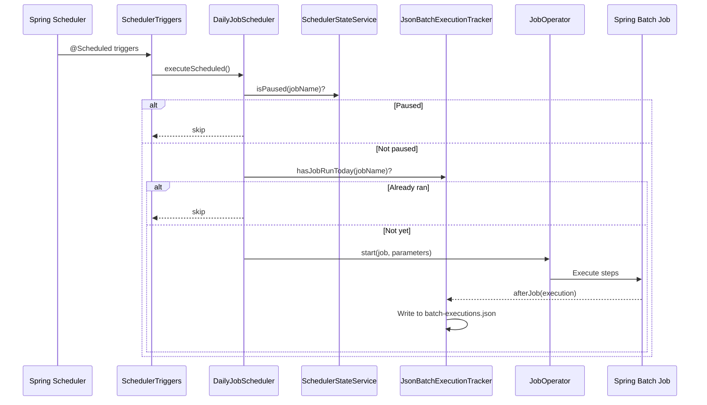
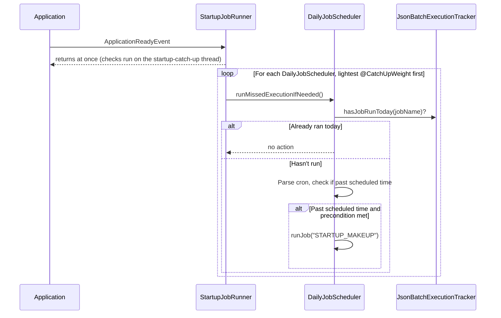

# Batch Jobs

## Shared Infrastructure

All batch jobs are built on Spring Batch and share a common scheduler framework in `comic-engine`.

### AbstractJobScheduler

Base class for all schedulers. Provides:

- Job execution via `JobOperator.start(Job, JobParameters)` (Spring Batch 6 API)
- Automatic `runId` parameter generation with timestamp for unique executions
- `trigger` parameter tracking (`SCHEDULED`, `MANUAL`, `STARTUP_MAKEUP`)
- Logging of initialization and execution start/completion

Two concrete subclasses:

| Subclass | Schedule Type | Key Behavior |
|----------|--------------|--------------|
| `DailyJobScheduler` | `DAILY` | Cron-based, missed execution detection, duplicate run prevention, pause/resume |
| `PeriodicJobScheduler` | `PERIODIC` | Fixed-delay interval, no missed execution logic |

### DailyJobScheduler

Constructor signature:

```java
public DailyJobScheduler(
    Job job,
    String cronExpression,
    String timezone,
    JobOperator jobOperator,
    JsonBatchExecutionTracker executionTracker)

public DailyJobScheduler(
    Job job,
    String cronExpression,
    String timezone,
    JobOperator jobOperator,
    JsonBatchExecutionTracker executionTracker,
    String description)
```

Key methods:

- `executeScheduled()` -- Called by `SchedulerTriggers`. Checks pause state and whether the job already ran today before executing.
- `triggerManually()` -- For API-driven manual runs. Bypasses the "already ran today" check. Runs in the background through `ManualJobLauncher` (a `TaskExecutorJobOperator` on `manualJobTaskExecutor`, `manual-job-*` threads with `MdcTaskDecorator`, so the job's log lines keep the request's `req=` and `user=`) and returns the execution id at once. Scheduled and `STARTUP_MAKEUP` runs stay on the calling thread. Each scheduler's lock allows one run of its job at a time and is released when the run ends, on whichever thread.
- `runMissedExecutionIfNeeded()` -- Called by `StartupJobRunner` on application startup. Compares current time against the cron schedule; if past the scheduled time and job hasn't run today, triggers a `STARTUP_MAKEUP` run, unless the scheduler's precondition (`setPrecondition`) says there is nothing to do. "Today" is the date in `batch.timezone`, not the JVM's zone.

### PeriodicJobScheduler

Constructor signature:

```java
public PeriodicJobScheduler(
    Job job,
    long fixedDelayMs,
    JobOperator jobOperator)
```

Available infrastructure for fixed-delay jobs. Currently unused -- all 6 jobs use `DailyJobScheduler`.

### JsonBatchExecutionTracker

Implements `JobExecutionListener`. Automatically captures execution data after each job completion and persists it to `batch-executions.json` in the cache directory.

- Keeps each job's executions from the last `batch.tracking.history-days` days (default 30), always including its newest, and drops history for jobs that no longer exist
- Handles migration from legacy single-entry format to list format
- Uses atomic write (`NfsFileOperations.atomicWrite`) for NFS safety
- Sets MDC context (`batchJobName`, `batchJobExecutionId`, `batchLogPath`) for structured logging
- Provides query methods: `getLastExecution()`, `getExecutionHistory()`, `getAllExecutionHistory()`, `hasJobRunToday()`, `hasJobRunSince()`

Each execution is captured as a `BatchExecutionSummary` containing: execution ID, job name, status, exit code, start/end times, parameters, step summaries (`BatchStepSummary` with read/write/filter/skip/commit/rollback counts), and error messages.

### SchedulerStateService

Manages runtime pause/resume state for schedulers. State is persisted to `scheduler-state.json` so it survives restarts. Uses a `SchedulerState` record containing `paused`, `lastToggled`, and `toggledBy` fields.

### SchedulerStateWiring

A `@PostConstruct` component that injects `SchedulerStateService` into all `DailyJobScheduler` beans after construction. This avoids circular dependency issues.

### StartupJobRunner

Listens for `ApplicationReadyEvent` (ordered at 100) to check for missed job executions. It hands the check to a background thread (`startup-catch-up`) and returns straight away, so readiness and `/actuator/health` don't wait for makeup runs. That thread calls `runMissedExecutionIfNeeded()` on each `DailyJobScheduler` bean in turn, lightest `@CatchUpWeight` first (on the scheduler's `@Bean` method; 0 without one, and equal weights keep their registration order). `PromoteFromDevJob` weighs -10 and `ComicDownloadJob` -5: after a restart that missed both, promotion copies dev's strips before the download fetches them, and today's strips aren't held up behind the maintenance jobs. `batch.startup-catch-up.enabled=false` turns makeup runs off; the integration test profiles do this. This runs after all beans are fully initialized, avoiding race conditions with strategy registration.

### SchedulerTriggers

Centralized `@Component` that holds `@Scheduled` methods for all 6 jobs. Each method delegates to the corresponding `DailyJobScheduler.executeScheduled()`. Individual triggers are gated by `@ConditionalOnProperty`.

### BatchJobBaseConfig

Constants class containing:

- `KNOWN_JOBS` set (used by health checks to detect missing/unexpected schedulers)
- `PropertyKeys` inner class with property key constants

## Job Configurations

All jobs follow the same pattern: a `@Configuration` class that defines a `Job` bean, one or more `Step` beans, and a `DailyJobScheduler` bean. All jobs register `JsonBatchExecutionTracker` as a listener. Job instance uniqueness is handled by `AbstractJobScheduler.buildJobParameters()`, which generates a timestamp-based `runId` for each execution.

### ComicDownloadJob

**Purpose:** Downloads today's comic strips from all enabled sources.

**Config class:** `ComicRetrievalJobConfig`

**Pattern:** Chunk-oriented (Reader/Processor/Writer) with chunk size 1.

- **Reader:** `ListItemReader<LocalDate>` providing `LocalDate.now()`
- **Processor:** Calls `managementFacade.updateComicsForDate(date)` which iterates all active comics, filters by publication day, and downloads each strip
- **Writer:** Logs success/failure per comic

**Data source:** `ManagementFacade` -> `DownloaderFacade` -> GoComics/ComicsKingdom web scraping

### ComicBackfillJob

**Purpose:** Backfills missing comic strips, recent days first, then older gaps.

**Config class:** `ComicBackfillJobConfig`

**Schedule:** Runs at every cron time (default `0 30 7-19/2 * * ?`, every 2 h from 90 minutes after the daily download until evening). A run that would overlap one still in progress is not launched. Before each scheduled run, `ComicBackfillService.hasMissingStrips()` checks local storage only. With `batch.comic-backfill.remember-cached-strips=true` (off when unset), strips it finds on disk are remembered for the rest of the day, so later checks and the run's own scan only look at the gaps again. This memory only decides which dates are scanned; it never serves images. The recent window is always rechecked on disk. Logging:
  - A remembered strip that has gone missing logs `Backfill cached-strip memory was wrong: ...` at WARN, and all of that comic's remembered strips are forgotten.
  - Each scan logs `Backfill scan: N dates checked on disk, M skipped as remembered on disk, K memory mismatches (...)`, at INFO for a run and at DEBUG for the pre-run check.
  - The daily reset logs `Backfill cached-strip memory reset for ...` at INFO.
  - Set the property to `false` to check every date on disk on every scan. If nothing is missing, the run is skipped: no web requests, and no execution recorded. There is no catch-up run at startup; the next cron time picks up the work. Manual triggers always run.

**Pattern:** Chunk-oriented with configurable chunk size (`batch.comic-backfill.chunk-size`, default 10).

- **Reader:** `ListItemReader<BackfillTask>` from `ComicBackfillService.findMissingStrips()` (step-scoped, evaluated at job run time). Per source, up to `max-per-run` tasks (capped by what's left of the optional `max-per-day`):
  1. **Recent pass:** the last `recent-days` (default 7) days, newest first, across every comic.
  2. **History pass:** older gaps, round-robin one per comic per round, so comics early in the alphabet can't take the whole budget.
- **Processor:** Calls `managementFacade.downloadComicForDate(comic, date, true)` per task, with a delay between downloads (`batch.comic-backfill.delay-between-comics-ms`, 10000 ms in `application.properties`). The `true` makes an HTTP 429 fail at once. The source still backs off through `SourceThrottleService`, and the processor skips that source's remaining tasks for the rest of the run. Strip-number tasks (Freefall) stop the same way on a 429.
- **Writer:** Logs per-chunk success, duplicate and failure counts, then flushes `BackfillStateService` (also flushed when the step ends)
- **Job parameters:** `source` (filter; options come from `SourceRegistry`), `comic` (a comic id, to backfill just that comic; the Sources page uses it), `resetState=true` (forget learned state before the run)
- **Scan floor:** a comic's dates are scanned back to the latest of the source's `max-days-back`, the comic's start, and any learned horizon. The start is the comic's `sourceStartDate` when known, otherwise the oldest stored strip, so a known start lets backfill reach further back than what is stored (see [start dates](source-catalog.md#start-dates)).

**Learned state (`backfill-state.json`, `BackfillStateService`):**
- A date that comes back unavailable, or as a duplicate of another date's image, `give-up-after` times (default 2) is skipped.
- `horizon-consecutive-failures` (default 3) different dates in a row, older than the recent window, coming back unavailable set a **comic horizon**: dates on or before the newest of them are no longer scanned.
- When `horizon-min-comics` (default 3) comics on one source have horizons within `horizon-tolerance-days` (default 2) of each other, that age becomes the **source horizon**, for example a paywall after about 7 days.
- Given-up dates and horizons expire after `retry-given-up-after-days` (default 30). A successful download older than a horizon clears it.
- Transient errors and 429s are never recorded. An HTTP 404 or 410 counts as unavailable.
- The state is kept in memory and written once per chunk; expired entries are dropped when it is written.

**Data source:** `ComicBackfillService` identifies gaps; `ManagementFacade` downloads individual strips; `BackfillStateService` remembers what didn't work

### AvatarBackfillJob

**Purpose:** Downloads missing avatar images for all comics that have a source configured.

**Config class:** `AvatarBackfillJobConfig`

**Pattern:** Tasklet (single step).

- Delegates to `managementFacade.downloadMissingAvatars()`
- Configurable delay between downloads (`batch.avatar-backfill.delay-between-downloads-ms`, default 2000ms)

**Data source:** `ManagementFacade` -> `DownloaderFacade` avatar download

### SourceCatalogJob

**Purpose:** Reads each source's list of comics for the Sources page, detects where a few configured comics start, reads comics' descriptions and tags, and downloads and tidies catalog thumbnails. See [Comic Sources and Their Catalogs](source-catalog.md).

**Config class:** `SourceCatalogJobConfig`

**Pattern:** Tasklet (single step).

- Refreshes each catalog older than `batch.source-catalog.max-age-days` (7); a scheduled or startup makeup run is skipped, without any request, when no catalog, details or thumbnails are due. Parameters: `source` (one source, or `ALL`) and `force=true` (ignore the age). The Sources page's Refresh button runs it for one source with `force=true`.
- Then detects starts for up to `batch.source-catalog.start-detect-per-run` (5) comics per source, reads due details for up to `batch.source-catalog.details-per-run` (100), purges thumbnails older than `comics.catalog.thumbnail-max-age-days` (365, plus 0–90 days per comic) and downloads up to `batch.source-catalog.thumbnails-per-run` (100) due ones
- Each of those stops a source at its first HTTP 429 (the source is backed off; the rest wait for the next run)
- A failed refresh fails the step after the other sources have run

**Data source:** `SourceCatalogService` → each `ComicSource`'s catalog (GoComics A–Z page, Comics Kingdom WordPress API)

### PromoteFromDevJob

**Purpose:** Copies the strips the dev instance already downloaded into prod, for the days prod is missing, so prod doesn't download them a second time. See [Promotion](../api/promotion.md) for the endpoints dev serves.

**Config class:** `PromoteFromDevJobConfig`

**Pattern:** Tasklet (single step), delegating to `DevPromotionService`.

- Runs at 07:00, after dev's 06:00 download and before prod's own (07:30), so on most days prod's download finds every strip already cached
- Parameters: `days` (default `batch.promote-from-dev.days`, 1 = today only; at most `comics.promotion.max-days`, 7), `source` (one source, or `ALL`) and `comic` (prod's comic id). A larger `days` fails the run at once
- Reads dev's manifest for the window, then for each comic enabled on prod that matches on source and source identifier (the two instances number comics separately), fetches each strip prod has no file for and saves it with `ComicStorageFacade.saveComicStripWithResult`. That validates it, skips duplicates and writes the date index, image hashes and metadata sidecar (with dev's transcript), as a download would. A strip already on disk is never fetched or overwritten
- Raises the comic's `oldest` / `newest` in `comics.json` to cover what it saved
- Indexed sources (Freefall) are left out: their strip numbers aren't in the manifest, and prod's own download tracks them
- Only prod sets `comics.promotion.source-url`; elsewhere scheduled and startup makeup runs are skipped by its precondition and a manual run does nothing. The job stays registered on dev rather than being switched off, since `SchedulerHealthCheck` reports a known job with no scheduler as down
- Dev unreachable or rejecting the token fails the run. A strip that can't be fetched or saved is logged at WARN and counted; the rest go on, and the step fails at the end so the batch history shows it. One INFO line sums up each run: `Promoted 46 strips from http://comics-api-dev:8888 for 2026-10-01 to 2026-10-01 (comics=46 already-here=0 duplicate=0 failed=0 not-here=3) in 9120ms`

**Data source:** the dev instance's `/api/v1/promotion/**` endpoints

### ImageMetadataBackfillJob

**Purpose:** Recalculates image dimensions and format metadata for existing images that lack metadata files.

**Config class:** `ImageMetadataBackfillJobConfig`

**Pattern:** Tasklet (single step) with streaming file walk.

- Walks the cache directory tree, filters for image files without metadata
- Validates each image via `ImageValidationService`
- Analyzes via `ImageAnalysisService` (color mode detection)
- Saves metadata via `ImageMetadataRepository`
- Processes up to `batchSize * 100` images per run (configurable via `batch.image-backfill.batch-size`, default 100)
- Lazy-initializes a comic directory map from `ComicConfigurationService` for O(1) comic ID lookups

**Data source:** Filesystem walk of cache directory

### MetricsArchiveJob

**Purpose:** Archives yesterday's access and storage metrics to persistent JSON storage.

**Config class:** `MetricsArchiveJobConfig`

**Pattern:** Tasklet (single step).

- Delegates to `metricsArchiveService.archiveMetricsForDate(yesterday)`
- Throws `IllegalStateException` on failure to mark the job as FAILED

**Data source:** `MetricsArchiveService` (from comic-metrics module), which builds combined metrics on demand via `MetricsUpdateService.buildCombinedMetrics()` and prunes archives past `comics.metrics.history-retention-days`

### RetrievalRecordPurgeJob

**Purpose:** Purges old retrieval records and batch log files beyond the retention window to prevent unbounded growth.

**Config class:** `RetrievalRecordPurgeJobConfig`

**Pattern:** Tasklet (two steps).

- **Step 1 — recordPurgeStep:** Delegates to `comicManagementFacade.purgeOldRetrievalRecords(daysToKeep)`
- **Step 2 — logPurgeStep:** Delegates to `batchJobLogService.purgeOldLogFiles(daysToKeep)` to delete old per-execution log files from `batch-logs/`
- Configurable retention via `batch.record-purge.days-to-keep` (default 30)

**Data source:** `ManagementFacade` -> `RetrievalStatusService`, `BatchJobLogService`

## Comparison Table

| Job | Pattern | Default Cron | Enabled Default | Data Source | Key Dependencies |
|-----|---------|-------------|----------------|-------------|-----------------|
| ComicDownloadJob | Chunk (R/P/W) | `0 0 6 * * ?` | `true` | Web scraping (GoComics, ComicsKingdom) | `ManagementFacade` |
| ComicBackfillJob | Chunk (R/P/W) | `0 30 7-19/2 * * ?` (several runs a day) | `true` | `ComicBackfillService` gap detection | `ManagementFacade`, `ComicBackfillService` |
| AvatarBackfillJob | Tasklet | `0 15 7 * * ?` | `true` | Web scraping (avatar pages) | `ManagementFacade` |
| ImageMetadataBackfillJob | Tasklet | `0 30 6 * * ?` | `true` | Filesystem walk | `ValidationService`, `AnalysisService`, `ImageMetadataRepository` |
| MetricsArchiveJob | Tasklet | `0 30 6 * * ?` | `true` | Combined metrics built on demand | `MetricsArchiveService` |
| PromoteFromDevJob | Tasklet | `0 0 7 * * ?` (skipped where `comics.promotion.source-url` isn't set) | `true` | Dev instance's promotion endpoints | `DevPromotionService`, `ComicStorageFacade` |
| RetrievalRecordPurgeJob | Tasklet (2 steps) | `0 45 6 * * ?` | `true` | JSON retrieval records, batch log files | `ManagementFacade`, `BatchJobLogService` |
| SourceCatalogJob | Tasklet | `0 0 5 * * ?` (runs only when a catalog, details or thumbnails are due) | `true` | Source catalogs (A–Z page, WordPress API) | `SourceCatalogService`, `CatalogThumbnailService` |

All jobs run in `batch.timezone` (`America/Toronto`), whatever the JVM's zone (UTC in the containers). Cron expressions are configurable via `batch.<job-key>.cron` properties. Code that needs today's date injects the application `Clock` (see Time Handling Rules in `CLAUDE.md`).

## Execution Flow


```mermaid
sequenceDiagram
    participant Spring as Spring Scheduler
    participant ST as SchedulerTriggers
    participant DJS as DailyJobScheduler
    participant SSS as SchedulerStateService
    participant JBET as JsonBatchExecutionTracker
    participant JO as JobOperator
    participant Job as Spring Batch Job

    Spring->>ST: @Scheduled triggers
    ST->>DJS: executeScheduled()
    DJS->>SSS: isPaused(jobName)?
    alt Paused
        DJS-->>ST: skip
    else Not paused
        DJS->>JBET: hasJobRunToday(jobName)?
        alt Already ran
            DJS-->>ST: skip
        else Not yet
            DJS->>JO: start(job, parameters)
            JO->>Job: Execute steps
            Job-->>JBET: afterJob(execution)
            JBET->>JBET: Write to batch-executions.json
        end
    end
```

## Startup Makeup Flow


```mermaid
sequenceDiagram
    participant App as Application
    participant SJR as StartupJobRunner
    participant DJS as DailyJobScheduler
    participant JBET as JsonBatchExecutionTracker

    App->>SJR: ApplicationReadyEvent
    SJR-->>App: returns at once (checks run on the startup-catch-up thread)
    loop For each DailyJobScheduler, lightest @CatchUpWeight first
        SJR->>DJS: runMissedExecutionIfNeeded()
        DJS->>JBET: hasJobRunToday(jobName)?
        alt Already ran today
            DJS-->>SJR: no action
        else Hasn't run
            DJS->>DJS: Parse cron, check if past scheduled time
            alt Past scheduled time and precondition met
                DJS->>DJS: runJob("STARTUP_MAKEUP")
            end
        end
    end
```
