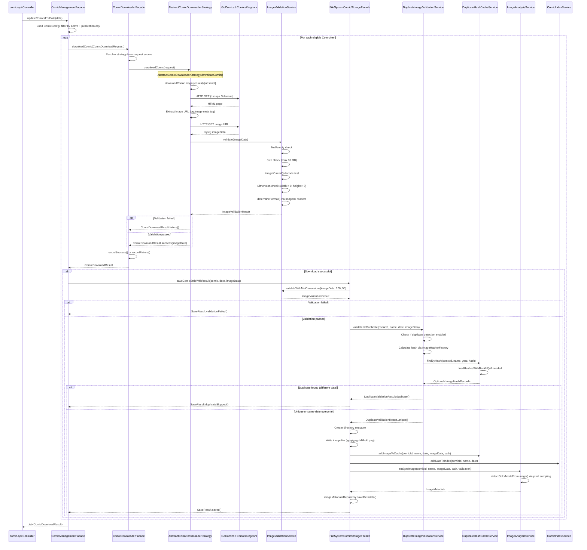

# Download Pipeline

End-to-end flow from API request through web scraping, validation, deduplication, and storage.

## Sequence Diagram

## Strategy Dispatch

The `ComicDownloaderFacade` maintains a `ConcurrentHashMap<String, ComicDownloaderStrategy>` of registered strategies. Strategies self-register at startup via `registerDownloaderStrategy(source, strategy)`.

| Source | Strategy Class | Scraping Method | Image Extraction |
|--------|---------------|-----------------|------------------|
| `gocomics` | `GoComicsDownloaderStrategy` | Jsoup HTTP client | `og:image` meta tag from Open Graph metadata |
| `comicskingdom` | `ComicsKingdomDownloaderStrategy` | Jsoup HTTP client | `og:image` meta tags (selects 2nd for hi-res) |

Both strategies extend `AbstractComicDownloaderStrategy` which provides the template method pattern:

1. Call `downloadComicImage(request)` (abstract, implemented by each strategy)
2. Validate the result with `imageValidationService.validate(imageData)`
3. Return `ComicDownloadResult.success()` or `ComicDownloadResult.failure()`

Avatar downloads follow the same pattern through `downloadAvatar()` / `downloadAvatarImage()`.

## Legacy Downloaders

The `IDailyComic` / `DailyComic` hierarchy predates the strategy pattern. `GoComics` uses Selenium WebDriver for JavaScript-rendered pages. `ComicsKingdom` uses Jsoup. These are being replaced by the `*DownloaderStrategy` classes.

## Storage Pipeline

`FileSystemComicStorageFacade.saveComicStripWithResult()` executes a multi-step pipeline:

1. **Image validation** -- `validateWithMinDimensions(imageData, 100, 50)` ensures the image is decodable and meets minimum strip dimensions.
2. **Duplicate detection** -- `DuplicateImageValidationService.validateNoDuplicate()` computes a hash and checks against the year-scoped hash cache. Same-date re-downloads are allowed (overwrite).
3. **File write** -- Creates `{cache-root}/{ComicName}/{yyyy}/{yyyy-MM-dd}.png`.
4. **Hash cache update** -- `DuplicateHashCacheService.addImageToCache()` stores the hash for future dedup.
5. **Index update (CRITICAL)** -- `ComicIndexService.addDateToIndex()` adds the date to the persistent index. If this fails, the file is deleted to maintain consistency.
6. **Metadata analysis (non-critical)** -- `ImageAnalysisService.analyzeImage()` detects color mode and saves `ImageMetadata` via `ImageMetadataRepository`.

Steps 4 and 6 are non-critical: failures are logged but do not fail the save. Step 5 is critical: failure triggers a rollback of the file write.

## Error Recording

`ComicDownloaderFacade` classifies exceptions into `ComicRetrievalStatus` categories:

| Exception Type | Status |
|---------------|--------|
| `ConnectException`, `SocketTimeoutException`, `IOException` | `NETWORK_ERROR` |
| `HttpStatusException` | `PARSING_ERROR` |
| `AccessDeniedException` | `STORAGE_ERROR` |
| All others | `UNKNOWN_ERROR` |

Failed downloads are recorded via `RetrievalStatusService.recordRetrievalResult()` and tracked in `ErrorTrackingService` for per-comic error history. Successful downloads clear the error history for that comic.
