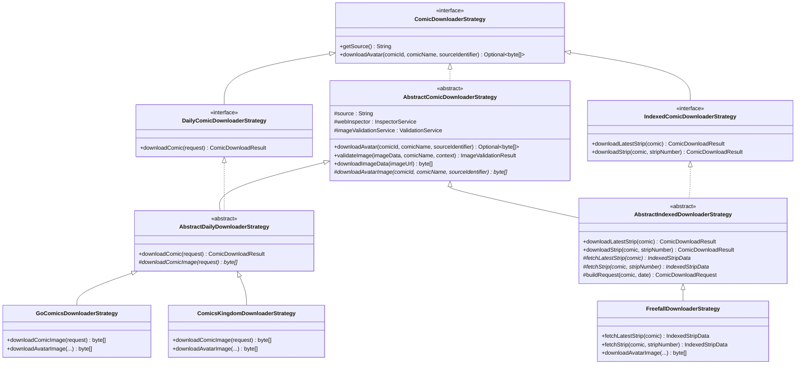
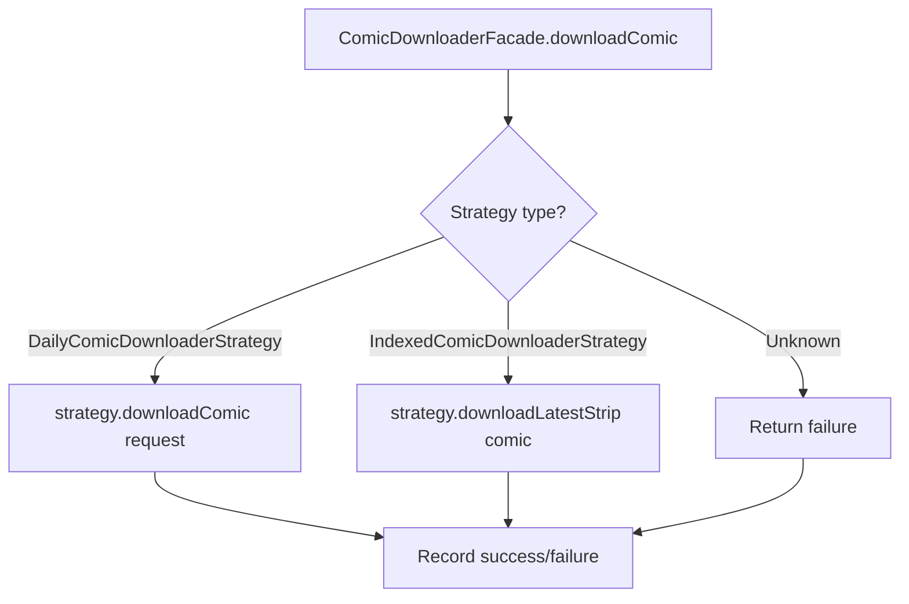

# Downloader Strategies

Interface hierarchy, strategy dispatch, and guide for adding new comic sources.

## Class Hierarchy

## Two Comic Models

Comics fall into two categories based on how they are addressed:

### Daily Comics

Date-based comics publish one strip per calendar date. The download request carries a `LocalDate` and the strategy builds a URL from it (e.g., `gocomics.com/{slug}/2026/03/22/`). Backfill walks a date range.

**Interface:** `DailyComicDownloaderStrategy`
**Sources:** GoComics, Comics Kingdom

### Indexed Comics

Strip-number-based comics are addressed by a sequential integer. The actual publication date is discovered from the page content after fetching. Backfill walks a strip-number range.

**Interface:** `IndexedComicDownloaderStrategy`
**Sources:** Freefall

Key differences from daily comics:

| Concern | Daily | Indexed |
|---------|-------|---------|
| Addressing | `LocalDate` | Strip number (`int`) |
| Date discovery | Known before download | Parsed from page after download |
| Backfill iteration | Date range | Strip-number range |
| Download method | `downloadComic(request)` | `downloadLatestStrip(comic)` / `downloadStrip(comic, stripNumber)` |
| Result metadata | Date from request | Date, strip number, and optional transcript from page |

## Base Classes

### AbstractComicDownloaderStrategy

The root abstract class providing shared infrastructure for all strategies:

- **`downloadAvatar()`** — Template method: calls the abstract `downloadAvatarImage()`, validates the result, returns `Optional<byte[]>`.
- **`validateImage()`** — Delegates to `ValidationService` for null/empty/decode/dimension checks.
- **`downloadImageData(url)`** — HTTP GET with configurable timeout and User-Agent from `DownloaderConstants`.

### AbstractDailyDownloaderStrategy

Template method for date-based downloads:

1. Calls `downloadComicImage(request)` (abstract — implemented by each source strategy).
2. Validates the image via `validateImage()`.
3. Returns `ComicDownloadResult.success()` or `ComicDownloadResult.failure()`.

Subclasses only implement `downloadComicImage()` and `downloadAvatarImage()`.

### AbstractIndexedDownloaderStrategy

Template method for strip-number-based downloads:

1. Calls `fetchLatestStrip(comic)` or `fetchStrip(comic, stripNumber)` (abstract).
2. Concrete strategies return an `IndexedStripData` record containing:
   - `byte[] imageData` — the raw image bytes
   - `LocalDate actualDate` — the date parsed from the page
   - `int stripNumber` — the strip number
   - `String transcript` — optional transcript text
3. Validates the image and builds a `ComicDownloadResult` with the discovered metadata.

Subclasses only implement `fetchLatestStrip()`, `fetchStrip()`, and `downloadAvatarImage()`.

## Strategy Dispatch

`ComicDownloaderFacade` maintains a `ConcurrentHashMap<String, ComicDownloaderStrategy>` of registered strategies. Each strategy self-registers at startup via `@PostConstruct` calling `registerDownloaderStrategy(source, strategy)`.

The facade routes requests based on strategy type:

Additional facade methods for indexed comics:

- **`downloadLatestStrip(comic)`** — Looks up the indexed strategy, downloads the latest strip, records the result.
- **`downloadStrip(comic, stripNumber)`** — Downloads a specific strip by number.
- **`isIndexedSource(source)`** — Returns `true` if the registered strategy implements `IndexedComicDownloaderStrategy`.

## Registered Strategies

| Source identifier | Strategy class | Comic model | Scraping method | Image extraction |
|-------------------|----------------|-------------|-----------------|------------------|
| `gocomics` | `GoComicsDownloaderStrategy` | Daily | Jsoup | `og:image` meta tag |
| `comicskingdom` | `ComicsKingdomDownloaderStrategy` | Daily | Jsoup | `og:image` meta tags (2nd for hi-res) |
| `freefall` | `FreefallDownloaderStrategy` | Indexed | Jsoup | `` tag matching strip number |

### FreefallDownloaderStrategy Details

Freefall is the first indexed comic source. Notable implementation details:

- **URL scheme:** `http://freefall.purrsia.com/ff{folder}/fc{NNNNN}.htm` (color) or `fv{NNNNN}.htm` (grayscale), where `folder = ((stripNumber - 1) / 100 + 1) * 100`.
- **Color preference:** Reads from `BackfillConfigurationService` to determine whether to fetch color (`fc`) or grayscale (`fv`) strips. Falls back to the alternate format on HTTP error.
- **Date discovery:** Parsed from the `<title>` tag (`"Freefall NNNN Month DD, YYYY"`) or from HTML comment nodes for older strips.
- **Transcript extraction:** Parses text after a `"TRANSCRIPT"` heading in the page, if present.

## Adding a New Source

### Daily Comic Source

1. Create a class extending `AbstractDailyDownloaderStrategy`.
2. Implement `downloadComicImage(ComicDownloadRequest request)` — fetch the page and return raw image bytes.
3. Implement `downloadAvatarImage(int comicId, String comicName, String sourceIdentifier)` — fetch the avatar image.
4. Annotate with `@Component` and inject dependencies.
5. Register via `@PostConstruct` calling `facade.registerDownloaderStrategy(SOURCE, this)`.
6. Add the source identifier to `ComicDownloaderConfig`.

### Indexed Comic Source

1. Create a class extending `AbstractIndexedDownloaderStrategy`.
2. Implement `fetchLatestStrip(ComicItem comic)` — fetch the latest strip page, parse it, return `IndexedStripData`.
3. Implement `fetchStrip(ComicItem comic, int stripNumber)` — fetch a specific strip by number, return `IndexedStripData`.
4. Implement `downloadAvatarImage(int comicId, String comicName, String sourceIdentifier)` — fetch the avatar image.
5. Annotate with `@Component` and inject dependencies.
6. Register via `@PostConstruct` calling `facade.registerDownloaderStrategy(SOURCE, this)`.
7. Add the source identifier to `ComicDownloaderConfig`.
8. Configure backfill parameters in `BackfillSourceConfig` (start strip number, end strip number).

### Backfill Support

The `ComicBackfillService` handles both comic models:

- **Daily comics:** Iterates a date range, calls `downloadComic()` for each date.
- **Indexed comics:** Iterates a strip-number range, calls `downloadStrip()` for each number. The actual date is discovered per-strip and used when saving.

Backfill configuration is source-specific in `BackfillSourceConfig`, which provides start/end strip numbers for indexed sources.
