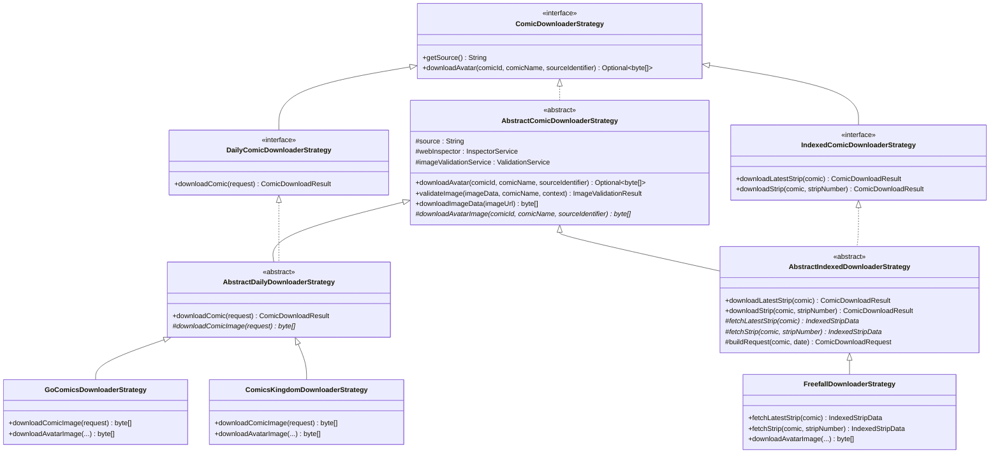
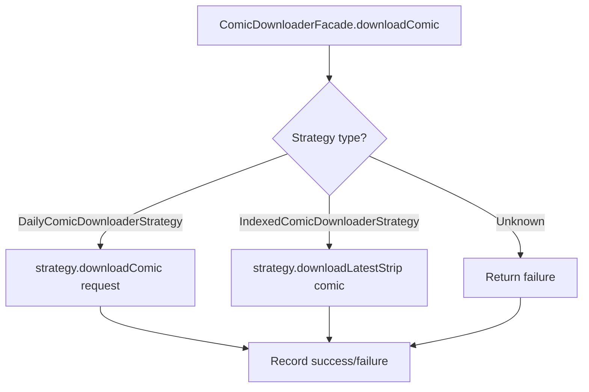

# Downloader Strategies

Interface hierarchy, strategy dispatch, and guide for adding new comic sources.

## Class Hierarchy

```mermaid
classDiagram
    class ComicDownloaderStrategy {
        <<interface>>
        +getSource() String
        +downloadAvatar(comicId, comicName, sourceIdentifier) Optional~byte[]~
    }

    class DailyComicDownloaderStrategy {
        <<interface>>
        +downloadComic(request) ComicDownloadResult
    }

    class IndexedComicDownloaderStrategy {
        <<interface>>
        +downloadLatestStrip(comic) ComicDownloadResult
        +downloadStrip(comic, stripNumber) ComicDownloadResult
    }

    class AbstractComicDownloaderStrategy {
        <<abstract>>
        #source : String
        #webInspector : InspectorService
        #imageValidationService : ValidationService
        +downloadAvatar(comicId, comicName, sourceIdentifier) Optional~byte[]~
        +validateImage(imageData, comicName, context) ImageValidationResult
        +downloadImageData(imageUrl) byte[]
        #downloadAvatarImage(comicId, comicName, sourceIdentifier)* byte[]
    }

    class AbstractDailyDownloaderStrategy {
        <<abstract>>
        +downloadComic(request) ComicDownloadResult
        #downloadComicImage(request)* byte[]
    }

    class AbstractIndexedDownloaderStrategy {
        <<abstract>>
        +downloadLatestStrip(comic) ComicDownloadResult
        +downloadStrip(comic, stripNumber) ComicDownloadResult
        #fetchLatestStrip(comic)* IndexedStripData
        #fetchStrip(comic, stripNumber)* IndexedStripData
        #buildRequest(comic, date) ComicDownloadRequest
    }

    class GoComicsDownloaderStrategy {
        +downloadComicImage(request) byte[]
        +downloadAvatarImage(...) byte[]
    }

    class ComicsKingdomDownloaderStrategy {
        +downloadComicImage(request) byte[]
        +downloadAvatarImage(...) byte[]
    }

    class FreefallDownloaderStrategy {
        +fetchLatestStrip(comic) IndexedStripData
        +fetchStrip(comic, stripNumber) IndexedStripData
        +downloadAvatarImage(...) byte[]
    }

    ComicDownloaderStrategy <|-- DailyComicDownloaderStrategy
    ComicDownloaderStrategy <|-- IndexedComicDownloaderStrategy
    ComicDownloaderStrategy <|.. AbstractComicDownloaderStrategy
    AbstractComicDownloaderStrategy <|-- AbstractDailyDownloaderStrategy
    AbstractComicDownloaderStrategy <|-- AbstractIndexedDownloaderStrategy
    DailyComicDownloaderStrategy <|.. AbstractDailyDownloaderStrategy
    IndexedComicDownloaderStrategy <|.. AbstractIndexedDownloaderStrategy
    AbstractDailyDownloaderStrategy <|-- GoComicsDownloaderStrategy
    AbstractDailyDownloaderStrategy <|-- ComicsKingdomDownloaderStrategy
    AbstractIndexedDownloaderStrategy <|-- FreefallDownloaderStrategy
```

## Two Comic Models

Comics fall into two categories based on how they are addressed:

### Daily Comics

Date-based comics publish one strip per calendar date. The download request carries a `LocalDate` and the strategy builds a URL from it (e.g., `gocomics.com/{slug}/2026/03/22/`). Backfill walks a date range.

**Interface:** `DailyComicDownloaderStrategy`
**Sources:** GoComics, Comics Kingdom

### Indexed Comics

Strip-number-based comics are addressed by a sequential integer. The actual publication date is discovered from the page content after fetching. Backfill walks a strip-number range.

**Interface:** `IndexedComicDownloaderStrategy`
**Sources:** Freefall

Key differences from daily comics:

| Concern | Daily | Indexed |
|---------|-------|---------|
| Addressing | `LocalDate` | Strip number (`int`) |
| Date discovery | Known before download | Parsed from page after download |
| Backfill iteration | Date range | Strip-number range |
| Download method | `downloadComic(request)` | `downloadLatestStrip(comic)` / `downloadStrip(comic, stripNumber)` |
| Result metadata | Date from request | Date, strip number, and optional transcript from page |

## Base Classes

### AbstractComicDownloaderStrategy

The root abstract class providing shared infrastructure for all strategies:

- **`downloadAvatar()`** — Template method: calls the abstract `downloadAvatarImage()`, validates the result, returns `Optional<byte[]>`.
- **`validateImage()`** — Delegates to `ValidationService` for null/empty/decode/dimension checks.
- **`downloadImageData(url)`** — HTTP GET with the timeout from `DownloaderConstants` and the source's User-Agent from `UserAgentService`. Throws `RateLimitedException` on HTTP 429.

### AbstractDailyDownloaderStrategy

Template method for date-based downloads:

1. Waits on `SourceThrottleService.await(source)`.
2. Calls `downloadComicImage(request)` (abstract — implemented by each source strategy).
3. On `RateLimitedException` (HTTP 429), backs off and retries from step 1 until the source's `retry.max-attempts` is used up (see [Throttling and Rate Limits](#throttling-and-rate-limits)).
4. Validates the image via `validateImage()`.
5. Returns `ComicDownloadResult.success()` or `ComicDownloadResult.failure()`. A failure carries a `FailureKind`: `UNAVAILABLE` (no image, empty or invalid image data, HTTP 404 or 410), `RATE_LIMITED` (HTTP 429), `BLOCKED` (HTTP 403), or `ERROR` (anything else).

Subclasses only implement `downloadComicImage()` and `downloadAvatarImage()`.

### AbstractIndexedDownloaderStrategy

Template method for strip-number-based downloads:

1. Calls `fetchLatestStrip(comic)` or `fetchStrip(comic, stripNumber)` (abstract).
2. Concrete strategies return an `IndexedStripData` record containing:
   - `byte[] imageData` — the raw image bytes
   - `LocalDate actualDate` — the date parsed from the page
   - `int stripNumber` — the strip number
   - `String transcript` — optional transcript text
3. Validates the image and builds a `ComicDownloadResult` with the discovered metadata. `downloadStrip()` classifies failures with the same `FailureKind` values as daily downloads; a 429 backs the source off once and is not retried.

Subclasses only implement `fetchLatestStrip()`, `fetchStrip()`, and `downloadAvatarImage()`.

## Throttling and Rate Limits

All outbound requests are paced per source by `SourceThrottleService`, configured under `downloader.sources.<source>.*` in `application.properties` (bound to `DownloaderProperties`).

| Property | Purpose |
|----------|---------|
| `throttle.min-delay-ms` / `throttle.max-delay-ms` | Random delay between consecutive requests to the source. `max-delay-ms=0` disables pacing. |
| `retry.max-attempts` | Total attempts per daily download when the source answers HTTP 429. Unset or `1` means no retries. |
| `retry.initial-backoff-ms` | Backoff after the first 429 when the server sends no `Retry-After`. Doubles per further attempt, plus up to 20% jitter. |
| `retry.max-backoff-ms` | Cap on any single backoff, including one requested by `Retry-After`. `0` means no cap. |
| `user-agent` | Per-source User-Agent override; otherwise `downloader.user-agent.default-value`. |

**HTTP 429 handling:**

1. `BrowserFetcher` (GoComics pages and page data) and `downloadImageData()` turn a 429 into `RateLimitedException`, carrying the `Retry-After` value (delta-seconds or HTTP-date) when the server sends one.
2. `AbstractDailyDownloaderStrategy` catches it and calls `SourceThrottleService.backOff(source, attempt, retryAfter)`. The backoff honours `Retry-After` when present, otherwise grows exponentially.
3. `backOff()` pushes the **whole source's** next-allowed time forward, so other comics from the same source also wait rather than hitting the limit again.
4. Each 429 is logged at WARN with the URL, attempt, `Retry-After` and backoff. When attempts run out the download fails with a `Rate limited (HTTP 429)` message.

A 429 that surfaces as a Jsoup `HttpStatusException` (sources that fetch pages with `Jsoup.connect().get()`) is not retried, but still backs the source off and is reported as `RATE_LIMITED`.

Only daily sources retry; indexed sources (Freefall) and avatar downloads fail on the first 429. Callers that pass `failFastOnRateLimit` (the backfill) get no retries either.

**HTTP 403 handling:** a 403 is reported as `BLOCKED`, never retried, and doesn't back the source off. One 403 can be a single forbidden strip, but several in a row mean the source's firewall is refusing us, and every further request only deepens the block. So after `DownloaderConstants.BLOCKED_IN_A_ROW_TO_STOP_SOURCE` (3) blocked downloads in a row from one source, the daily download run (`ComicManagementFacade`) skips that source's remaining comics for the date, and the backfill skips its remaining tasks until the next run. Each logs one WARN when it stops the source. In retrieval status a 403 stays `NETWORK_ERROR` with HTTP status 403.

**Browser identity:** GoComics sits behind Cloudflare, so requests present as desktop Chrome. `downloader.user-agent.default-value` carries the Chrome UA, and `BrowserFetcher` (used by `GoComicsDownloaderStrategy` and the GoComics catalog) derives matching `Sec-Ch-Ua` client hints from the Chrome major version in that UA (omitted for non-Chrome UAs). Keep the Chrome major version current ([Chromium Dash](https://chromiumdash.appspot.com/releases)); a stale browser version is a bot signal. Bump `UserAgentService.FALLBACK_USER_AGENT` at the same time. `Accept-Encoding` omits `zstd`, since only gzip and Brotli are decoded.

**GoComics page data:** GoComics is a Next.js site. Since October 2026 its firewall (Bunny Shield) has answered full page loads of strip pages from our IP with 403, while still serving the React Server Components payload the site's router fetches when a reader clicks through to a date. `GoComicsDownloaderStrategy` therefore never loads the HTML page. `BrowserFetcher.fetchNextJsFlight()` requests `https://www.gocomics.com/<slug>/<yyyy>/<MM>/<dd>` with `RSC: 1`, `Next-Url: /<slug>` and the `_rsc` cache-busting parameter the router would send (SHA-256 of `0,0,0,<next-url>`, first 12 bytes, base64url; the server doesn't check it). The payload (`text/x-component`, about 350 KB) holds several `"comic":{...}` objects: the page's strip and related strips from other dates. The strategy takes the image `url` of the one whose `date` is the requested date; none means no strip that day (`UNAVAILABLE`). Avatars still come from the `/<slug>/about` HTML page, which the firewall allows.

## Strategy Dispatch

`ComicDownloaderFacade` maintains a `ConcurrentHashMap<String, ComicDownloaderStrategy>` of registered strategies. `SourceRegistry` fills it at startup: it collects every `ComicSource` bean and registers each one's `downloader()` under its `id()` (see [Comic Sources and Their Catalogs](source-catalog.md)).

The facade routes requests based on strategy type:

```mermaid
flowchart TD
    A[ComicDownloaderFacade.downloadComic] --> B{Strategy type?}
    B -->|DailyComicDownloaderStrategy| C[strategy.downloadComic request]
    B -->|IndexedComicDownloaderStrategy| D[strategy.downloadLatestStrip comic]
    B -->|Unknown| E[Return failure]
    C --> F[Record success/failure]
    D --> F
    E --> F
```

Additional facade methods for indexed comics:

- **`downloadLatestStrip(comic)`** — Looks up the indexed strategy, downloads the latest strip, records the result.
- **`downloadStrip(comic, stripNumber)`** — Downloads a specific strip by number.
- **`isIndexedSource(source)`** — Returns `true` if the registered strategy implements `IndexedComicDownloaderStrategy`.

## Registered Strategies

| Source identifier | Strategy class | Comic model | Scraping method | Image extraction |
|-------------------|----------------|-------------|-----------------|------------------|
| `gocomics` | `GoComicsDownloaderStrategy` | Daily | Jsoup (`BrowserFetcher`) | The date's strip object in the page's RSC payload |
| `comicskingdom` | `ComicsKingdomDownloaderStrategy` | Daily | Jsoup | `og:image` meta tags (2nd for hi-res) |
| `freefall` | `FreefallDownloaderStrategy` | Indexed | Jsoup | `` tag matching strip number |

### FreefallDownloaderStrategy Details

Freefall is the first indexed comic source. Notable implementation details:

- **URL scheme:** `http://freefall.purrsia.com/ff{folder}/fc{NNNNN}.htm` (color) or `fv{NNNNN}.htm` (grayscale), where `folder = ((stripNumber - 1) / 100 + 1) * 100`.
- **Color preference:** Reads from `BackfillConfigurationService` to determine whether to fetch color (`fc`) or grayscale (`fv`) strips. Falls back to the alternate format on HTTP error.
- **Date discovery:** Parsed from the `<title>` tag (`"Freefall NNNN Month DD, YYYY"`) or from HTML comment nodes for older strips.
- **Transcript extraction:** Parses text after a `"TRANSCRIPT"` heading in the page, if present.

## Adding a New Source

A source is a downloader strategy plus one `ComicSource` bean. `SourceRegistry` picks the bean up, registers its downloader, and adds the source to the batch jobs' `source` parameter, comic validation and the Sources page. No other wiring is needed.

### Daily Comic Source

1. Create a class extending `AbstractDailyDownloaderStrategy`.
2. Implement `downloadComicImage(ComicDownloadRequest request)` — fetch the page and return raw image bytes.
3. Implement `downloadAvatarImage(int comicId, String comicName, String sourceIdentifier)` — fetch the avatar image.
4. Annotate with `@Component` and inject dependencies.
5. Add a `@Component` implementing `ComicSource` (`engine.source`). It returns the strategy from `downloader()`, the downloader's name fallback from `identifierFor()`, and its image hosts. Implement `catalog()` and `startDetector()` if the source lists its comics or says where they start, pacing every request through `SourceThrottleService.withRetries`.
6. Add `downloader.sources.<id>.*` throttle and retry settings, and `downloader.sources.<id>-assets.*` if catalog thumbnails come from a separate image host.

### Indexed Comic Source

1. Create a class extending `AbstractIndexedDownloaderStrategy`.
2. Implement `fetchLatestStrip(ComicItem comic)` — fetch the latest strip page, parse it, return `IndexedStripData`.
3. Implement `fetchStrip(ComicItem comic, int stripNumber)` — fetch a specific strip by number, return `IndexedStripData`.
4. Implement `downloadAvatarImage(int comicId, String comicName, String sourceIdentifier)` — fetch the avatar image.
5. Annotate with `@Component` and inject dependencies.
6. Add a `ComicSource` as for a daily source. A single-comic source (like Freefall) can return a fixed one-entry catalog and a start of strip 1.
7. Configure backfill parameters in `BackfillSourceConfig`. The first strip number comes from the comic's `firstStripNumber`.

### Backfill Support

The `ComicBackfillService` handles both comic models:

- **Daily comics:** Iterates a date range, calls `downloadComic()` for each date.
- **Indexed comics:** Iterates a strip-number range, calls `downloadStrip()` for each number. The actual date is discovered per-strip and used when saving.

Backfill configuration is source-specific in `BackfillSourceConfig`, which provides start/end strip numbers for indexed sources.
