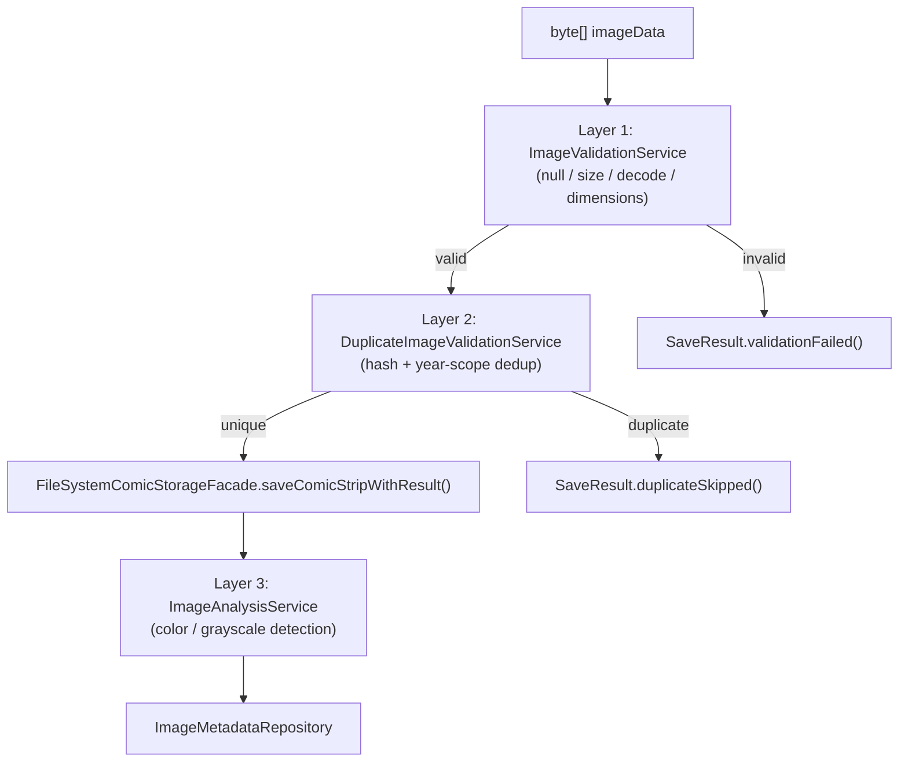

# Image Validation Pipeline

Image processing in ComicCacher uses a 3-layer pipeline. Each layer serves a distinct purpose and can be invoked independently.

## Pipeline Overview



## Layer 1: ImageValidationService

**Class:** `org.stapledon.engine.validation.ImageValidationService`
**Implements:** `org.stapledon.common.service.ValidationService`

Validates that raw image bytes represent a well-formed, decodable image.

### Validation Steps

| Step | Check | Failure Message |
|------|-------|----------------|
| 1 | `imageData == null \|\| imageData.length == 0` | "Image data is null or empty" |
| 2 | `imageData.length > 10 * 1024 * 1024` (10 MB) | "Image exceeds maximum size" |
| 3 | `ImageIO.read(data) == null` | "ImageIO could not decode image data" |
| 4 | `width <= 0 \|\| height <= 0` | "Invalid dimensions" |
| 5 | Format detection via `ImageIO.getImageReaders()` | Falls back to `UNKNOWN` |

### Methods

- `validate(byte[])` -- Runs all 5 steps. Returns `ImageValidationResult` with format, dimensions, size.
- `validateWithMinDimensions(byte[], minWidth, minHeight)` -- Runs `validate()` then checks minimum dimensions. Used by `FileSystemComicStorageFacade` with minimums of 100x50 for comic strips.
- `isValidImage(byte[])` -- Convenience boolean wrapper around `validate()`.

### Supported Formats

Format detection uses `ImageIO.getImageReaders()` which includes both standard JDK formats and TwelveMonkeys ImageIO plugins.

| Format | Enum Value | Plugin |
|--------|-----------|--------|
| PNG | `ImageFormat.PNG` | JDK built-in |
| JPEG | `ImageFormat.JPEG` | JDK built-in + `imageio-jpeg` |
| GIF | `ImageFormat.GIF` | JDK built-in |
| BMP | `ImageFormat.BMP` | `imageio-bmp` |
| WebP | `ImageFormat.WEBP` | `imageio-webp` |
| TIFF | `ImageFormat.TIFF` | `imageio-tiff` |

TwelveMonkeys version: see root `build.gradle` (`twelvemonkeysVersion`).

## Layer 2: DuplicateImageValidationService

**Class:** `org.stapledon.engine.validation.DuplicateImageValidationService`
**Implements:** `org.stapledon.common.service.DuplicateValidationService`

Prevents saving the same comic strip multiple times within the same year by comparing image hashes.

### Deduplication Logic

1. Check if duplicate detection is enabled (`comics.cache.duplicateDetectionEnabled` property). If disabled, return `unique`.
2. Calculate hash of incoming image using the configured algorithm via `ImageHasherFactory.getImageHasher()`.
3. Search the year-scoped hash cache via `DuplicateHashCacheService.findByHash(comicId, comicName, year, hash)`.
4. If a matching hash exists:
   - **Same date:** Allow overwrite (return `unique`). This supports re-downloading the same strip.
   - **Different date:** Return `duplicate` with the original date and file path.
5. If no match: Return `unique`.

### Hash Algorithms

Configurable via `comics.cache.hashAlgorithm` property (in `CacheProperties`). The `ImageHasherFactory` selects the implementation at runtime.

| Algorithm | Class | Type | Output | Behavior |
|-----------|-------|------|--------|----------|
| `MD5` | `MD5ImageHasher` | Cryptographic | 32-char hex | Byte-exact matching. Fast. Won't catch re-encoded images. |
| `SHA256` | `SHA256ImageHasher` | Cryptographic | 64-char hex | Byte-exact matching. Slower, more collision-resistant. |
| `AVERAGE_HASH` | `AverageImageHasher` | Perceptual | 16-char hex (64-bit) | Resize to 8x8 grayscale, compare pixels to average. Catches re-encoded duplicates. |
| `DIFFERENCE_HASH` | `DifferenceImageHasher` | Perceptual | 16-char hex (64-bit) | Resize to 9x8 grayscale, compare adjacent pixel gradients. More robust than average hash. |

Perceptual hash algorithms (Average and Difference) work by:
1. Resizing the image to a small grayscale thumbnail (8x8 or 9x8)
2. Computing a 64-bit fingerprint from pixel relationships
3. Outputting a 16-character hex string

These detect visually similar images even if the underlying bytes differ (e.g., re-encoded PNGs, slight compression changes).

### DuplicateHashCacheService

Manages the per-comic, per-year hash cache with automatic backfill and algorithm migration.

- **Storage:** JSON files managed by `DuplicateImageHashRepository`, one per comic per year.
- **Backfill:** When the hash cache is empty but image files exist, automatically reads all images in the year directory and computes hashes.
- **Algorithm migration:** When the configured algorithm differs from the stored algorithm, the cache is rebuilt automatically.
- **Lazy loading:** Hashes are loaded and backfilled on first access via `loadHashesWithBackfill()`.

## Layer 3: ImageAnalysisService

**Class:** `org.stapledon.engine.analysis.ImageAnalysisService`
**Implements:** `org.stapledon.common.service.AnalysisService`

Analyzes saved images to determine color mode. This layer runs after the image has been saved to disk (non-critical -- failures don't block the save).

### Color Detection

Uses random pixel sampling to classify images:

1. Decode image via `ImageIO.read()`
2. Calculate sample count: `totalPixels * (samplePercentage / 100.0)` (configurable via `comics.metrics.color-detection.sample-percentage`, default 5.0%)
3. Sample random pixels and extract RGB components
4. If any sampled pixel has `R != G` or `G != B`, classify as `COLOR`
5. If all sampled pixels have equal RGB components, classify as `GRAYSCALE`
6. If image cannot be decoded, classify as `UNKNOWN`

### Output

Returns an `ImageMetadata` record containing:
- `comicId`, `comicName`, `filePath`
- `format`, `width`, `height`, `sizeInBytes` (from Layer 1 validation)
- `colorMode` (`COLOR`, `GRAYSCALE`, `UNKNOWN`)
- `samplePercentage` used
- `captureTimestamp` (OffsetDateTime)
- `sourceUrl` (if available)

Metadata is persisted by `ImageMetadataRepository`.

## Integration Point

All three layers are orchestrated by `FileSystemComicStorageFacade.saveComicStripWithResult()`:

```
1. Layer 1: validateWithMinDimensions(imageData, 100, 50)    -- BLOCKING
2. Layer 2: validateNoDuplicate(comicId, name, date, data)   -- BLOCKING
3. File write to disk
4. Hash cache update                                          -- non-critical
5. Index update                                               -- CRITICAL (rollback on failure)
6. Layer 3: analyzeImage() + saveMetadata()                   -- non-critical
```

Layer 1 is also invoked independently during download in `AbstractComicDownloaderStrategy.downloadComic()` to reject invalid images before they reach the storage layer.
