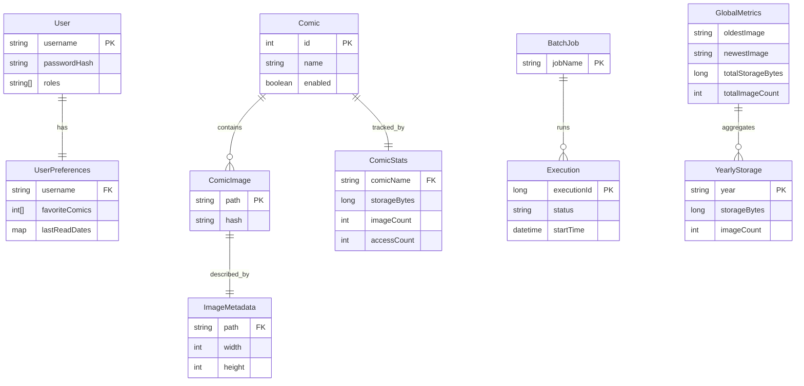

# Storage Details for ComicCacher

This document outlines the JSON files used for data storage in the ComicCacher application. It serves as the single source of truth for file inventory, schemas, and location logic, verified against the codebase.

## Module Overview

The JSON storage implementation is distributed across these modules:

- **`comic-api`**: Core configuration (Comics, Users, Preferences).
  - *Classes*: `JsonConfigWriter`, `JsonComicRepository`, `JsonUserRepository`
- **`comic-engine`**: Operational state (Batch jobs, Errors, Retrieval Status, Hashes).
  - *Classes*: `JsonErrorTrackingRepository`, `JsonRetrievalStatusRepository`, `DuplicateImageHashRepository`
- **`comic-metrics`**: Usage metrics.
  - *Classes*: `AccessMetricsRepository`, `JsonMetricsRepository`
- **`comic-common`**: Shared utilities.

## Data Relationship Diagram



## Inventory of Storage Files

All paths relative to the configured cache location unless otherwise noted.

### 1. Configuration Files
Configurable via properties or loaded from classpath.

| File Name | Purpose | Responsible Class | Location Logic |
| :--- | :--- | :--- | :--- |
| `ComicCacher.json` | Bootstrap configuration (list of comics to cache). | `CacherConfigLoader` | **Classpath** (`src/main/resources`). |
| `comics.json` | Registry of available comics and metadata. | `JsonComicRepository` | Configurable `comics.cache.config`. Defaults to `./comics.json`. |
| `users.json` | User accounts, credentials (hashed), and roles. | `JsonUserRepository` | Configurable `comics.cache.usersConfig`. Defaults to `./users.json`. |
| `preferences.json` | User favorites and reading history. | `JsonPreferenceRepository` | Configurable `comics.cache.preferencesConfig`. Defaults to `./preferences.json`. |

### 2. Operational State
Track runtime state and job history. Located in the **Cache Root**.

| File Name | Purpose | Responsible Class | File Name Constant |
| :--- | :--- | :--- | :--- |
| `batch-executions.json` | History of Spring Batch job executions. | `JsonBatchExecutionTracker` | `BATCH_EXECUTIONS_FILENAME` |
| `retrieval-status.json` | Status of last comic retrieval attempts. | `JsonRetrievalStatusRepository` | `STORAGE_FILE` |
| `last_errors.json` | Recent errors per comic (capped count). | `JsonErrorTrackingRepository` | `STORAGE_FILE` |

### 3. Metrics
Aggregated usage and storage statistics. Located in the **Cache Root**.

| File Name | Purpose | Responsible Class | File Name Constant |
| :--- | :--- | :--- | :--- |
| `access-metrics.json` | Aggregated access counts. | `AccessMetricsRepository` | `ACCESS_METRICS_FILE` |
| `combined-metrics.json` | Global + per-comic storage and access metrics. | `JsonMetricsRepository` | `COMBINED_METRICS_FILE` |

> [!NOTE]
> The `MetricsRepository` interface abstracts persistence, making it easy to swap JSON storage for Prometheus or another backend in the future.

### 4. Content Metadata
Metadata associated with specific content. Located in **Comic/Year Directories**.

| File Name | Purpose | Responsible Class | Location Pattern |
| :--- | :--- | :--- | :--- |
| `image-hashes.json` | Perceptual hashes for duplicate detection. | `DuplicateImageHashRepository` | `{CacheRoot}/{ComicName}/{Year}/image-hashes.json` |
| `*.json` (Sidecar) | Metadata for specific images. | `ImageMetadataRepository` | `{CacheRoot}/{ComicName}/{Year}/{Date}.json` |

## Schemas

### 1. ComicCacher.json (Bootstrap)
```json
{
  "dailyComics": [
    {
      "name": "String",
      "startDate": { "year": "Integer", "month": "Integer", "day": "Integer" }
    }
  ],
  "kingComics": [ ... ]
}
```

### 2. comics.json
```json
{
  "items": {
    "[hash_id]": {
      "id": "Integer",
      "name": "String",
      "enabled": "Boolean",
      "oldest": "LocalDate",
      "newest": "LocalDate"
    }
  }
}
```

### 3. users.json
```json
{
  "users": {
    "[username]": {
      "username": "String",
      "passwordHash": "String",
      "roles": ["String"],
      "userToken": "UUID"
    }
  }
}
```

### 4. preferences.json
```json
{
  "preferences": {
    "[username]": {
      "favoriteComics": ["Integer"],
      "lastReadDates": { "[comicId]": "LocalDate" }
    }
  }
}
```

### 5. batch-executions.json
```json
{
  "[jobName]": {
    "lastExecutionId": "Long",
    "status": "COMPLETED|FAILED",
    "startTime": "LocalDateTime",
    "endTime": "LocalDateTime"
  }
}
```

### 6. combined-metrics.json
```json
{
  "lastUpdated": "LocalDateTime",
  "globalMetrics": {
    "oldestImage": "String (absolute path)",
    "newestImage": "String (absolute path)",
    "years": ["String"],
    "totalStorageBytes": "long",
    "totalImageCount": "int",
    "storageByYear": { "[year]": "long" },
    "imageCountByYear": { "[year]": "int" }
  },
  "perComicMetrics": {
    "[comicName]": {
      "comicName": "String",
      "storageBytes": "long",
      "imageCount": "int",
      "averageImageSize": "double",
      "yearlyStorage": {
        "[year]": { "storageBytes": "long", "imageCount": "int" }
      },
      "accessCount": "int",
      "lastAccess": "String",
      "averageAccessTime": "double",
      "hitRatio": "double",
      "cacheHits": "int",
      "cacheMisses": "int"
    }
  }
}
```